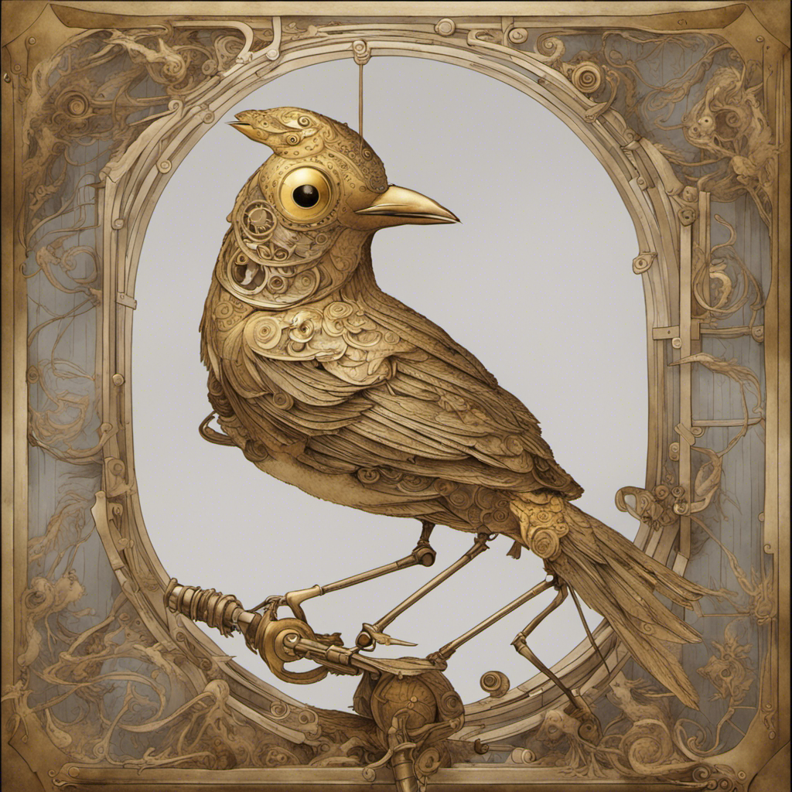
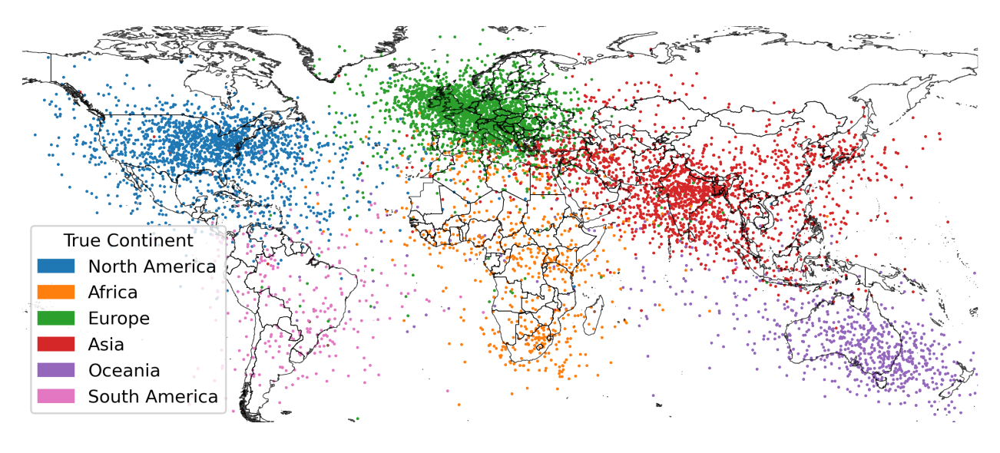
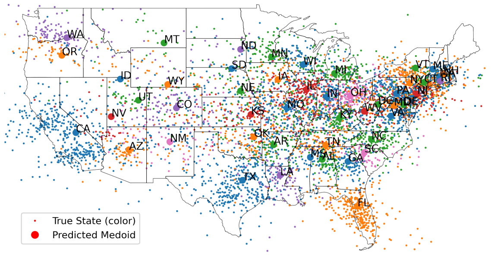

```{css echo=FALSE}
.pull-left {
  float: left;
  width: 44%;
}
.pull-right {
  float: right;
  width: 44%;
}
.pull-right ~ p {
  clear: both;
}


.pull-left-wide {
  float: left;
  width: 66%;
}
.pull-right-wide {
  float: right;
  width: 66%;
}
.pull-right-wide ~ p {
  clear: both;
}

.pull-left-narrow {
  float: left;
  width: 30%;
}
.pull-right-narrow {
  float: right;
  width: 30%;
}

.tiny123 {
  font-size: 0.40em;
}

.small123 {
  font-size: 0.80em;
}

.large123 {
  font-size: 2em;
}

.red {
  color: red
}

.orange {
  color: orange
}

.green {
  color: green
}
```

# Today's lecture
.pull-left[
- Course overview
- How did we get to ChatGPT? (And what are the implications)
- An example of some research I do using the techniques of the course
]

.pull-right[

]

---
# Motivaiton for the course 

.pull-left[
- *It's all about information*
- Text is data. Data is text. 
- Applications: Business, Finance, Research, Software Development, Psychology, Linguistics, Business Intelligence, Policy Evaluation 
- In a world of LLMs you want to understand what is happening behind the fancy interface 
- The techniques live inside crazy sci-fi technologies, that you can learn. E.g. [literal mind reading](https://www.nature.com/articles/s41593-023-01304-9)
]

.pull-right[

*Counter-example to what we will be doing*
*[[xkcd.com/1838]](xkcd.com/1838)*
]

---
# About me - Christian Vedel
.pull-left[
- Economic Historian - freshly minted PhD 
- Research at the intersection between machine learning and economic history 
- A genuine interest in language, linguistics and etymology  
  + All though you will find my texts riddled with typos and grammatical errors 
- Write me emails
  + .orange[christian-vs@sam.sdu.dk]
- We can make office hours if you want it. 

[Who are you? https://forms.gle/4T3Cjr42jwbx6vHHA](https://forms.gle/4T3Cjr42jwbx6vHHA)

]

.pull-right[

.small123[*PhD defence, 2023-09-25*]
]

---
# What to expect
- **Structure of the lectures**
  + 2x45 min. of lecture 
  + 40 + 5 min. of coding challenge
- **Book:**
  + We will use NLTK Natural Language Processing with Python by Ewan Klein, Steven Bird and Edward Loper https://www.nltk.org/book/
- **Exam:**
  + One week project in January (intended to be challenging) 
- **Course content:**
  + Low level NLP tools + applications 
  + Transformers $\rightarrow$ Basics $\rightarrow$ Transformers
- **Course plan:**
  + Continously updated on itslearning 
- **Slides:**
  + The night before the lecture 
  + Will not cover everything I say. Please bring a notepad and a pen.
- **Course description:**
  + https://odin.sdu.dk/sitecore/index.php?a=searchfagbesk&bbcourseid=N340076101-f-E23&lang=en 
  + Course plan on itslearning
  + [GitHub](https://github.com/christianvedels/News_and_Market_Sentiment_Analytics)
  
---
# Preperation
.pull-left[
- Read other literature assigned. 
- Read assigned NLTK chapter. 
- Run code line by line while doing so.
- Make sure you understand what is happening. 
- Please go off tangents. Tangents are the best - if not for this specific course.

**Coding challenge:**
- Requires that you have tried the code in preparation 
- Will be challenging 
- Mistakes are great
- Make sure that you understand and can run the solution
]

.pull-right[

]

---
# Course plan
.small123[
| Date       | Slides | Assigned Reading* |
|------------|--------|-------------------|
| 2023-10-24 | [Lecture 1 - Context and setup](https://raw.githack.com/christianvedels/News_and_Market_Sentiment_Analytics/main/Lecture%201%20-%20Context%20and%20setup/Slides.html)    | [itslearning]    |
| 2023-10-31 | [Lecture 2 - Lexical resources](https://raw.githack.com/christianvedels/News_and_Market_Sentiment_Analytics/main/Lecture%202%20-%20Lexical%20resources/Slides.html) | NLTK ch. 2, ch. 3 ([NLTK Book](https://www.nltk.org/book/)), [The Zipf Mystery](https://youtu.be/fCn8zs912OE?si=NptILXURFS4WaFnw ) |
| 2023-11-07 | [Lecture 3 - Classification pt 1](https://raw.githack.com/christianvedels/News_and_Market_Sentiment_Analytics/main/Lecture%203%20-%20Classification%20pt%201/Slides.html) | NLTK ch. 4, ch. 5 ([NLTK Book](https://www.nltk.org/book/)) |
| 2023-11-14 | [Lecture 4 - Classification pt 2](https://raw.githack.com/christianvedels/News_and_Market_Sentiment_Analytics/main/Lecture%204%20-%20Classification%20pt%202/Slides.html) | NLTK ch. 5, ch. 6 ([NLTK Book](https://www.nltk.org/book/)), [Towards Data Science Article](https://towardsdatascience.com/introduction-to-embedding-clustering-and-similarity-11dd80b00061) |
| 2023-11-21 | [Lecture 5 - Understanding and utilizing grammar](https://raw.githack.com/christianvedels/News_and_Market_Sentiment_Analytics/main/Lecture%205%20-%20Understanding%20and%20utilizing%20grammar/Slides.html) | Entity recognition article, NLTK ch. 7, ch. 8 ([NLTK Book](https://www.nltk.org/book/)) |
| 2023-11-28 | [Lecture 6 - The meaning of sentences](https://raw.githack.com/christianvedels/News_and_Market_Sentiment_Analytics/main/Lecture%206%20-%20The%20meaning%20of%20sentences/Slides.html) | NLTK ch. 9, ch. 10 ([NLTK Book](https://www.nltk.org/book/)) |
| 2023-12-05 | [Lecture 7 - Sentiment analysis](https://raw.githack.com/christianvedels/News_and_Market_Sentiment_Analytics/main/Lecture%207%20-%20Sentiment%20analysis/Slides.html) | Reading follows |
| 2023-12-12 | [Lecture 8 - Remaining topics](https://raw.githack.com/christianvedels/News_and_Market_Sentiment_Analytics/main/Lecture%208%20-%20Remaining%20topics/Slides.html#1) | Reading follows |
]

.footnote[
.small123[\* Expect this to change]
]

  
---
class: inverse, middle, center

# How did we get to ChatGPT?

---
# The promise of AI
.pull-left[
- The idea of the mechanic 'nightingale' ([HC] Andersen, 1844)
  + **Idea:** The mechanic version can never be as good because it is mechanic 
  + Reaches far back e.g. Descartes (1637) writes about automata in 'Discourse and Methods' 
- Can machines things? The idea of the Turing test (1950/60s)
  + If machines can think, they will respond convincingly in conversation 

]

.pull-right[

*Generated in beta.dreamstudio.ai*
]

---
# Early rule-based systems
.pull-left[
- We can model behaviour by *if then* statements 
- ELIZA (Weizenbaum, 1966):
  + The earliest convincing chatbot
  + Looks for keywords and otherwise writes something generic or repeats something from earlier
- 1980's was the peak of rule based systems 
  + Based on linguistic theory
  + Grammar 
  + Morphology
  + Semantics
]

.pull-right[

*ELIZA Conversation (Wikimedia Commons)* 

*Semantic net*
]

---
# The philosophical/linguistic problem
.pull-left[
- Can we distinguish reasoning from immitation? 
  + Chinese room problem (Seale, 1980) 
- What is the nature of language? 
  + Innateness vs. Empiricism (Chomsky vs. Vienna circle*)
  + Innateness $\rightarrow$ rule-based NLP 
  + Empiricism $\rightarrow$ 'empirical' (learning) methods 
- ChatGPT is a big score for the Empiricist hypothesis
]

.footnote[
\* E.g. (of names you might know) Gödel, Popper, 
Reichenbach, Wittgenstein [(Wikipedia)](https://en.wikipedia.org/wiki/Vienna_Circle#Overview_of_the_members_of_the_Vienna_Circle)
]

.pull-right[

]

---
# 90s computer power - 60s maths
.pull-left[
- **Empiricist problem**: Statistics alone can only predict - not understand structure. Mathematical limitation (Pearl, 2019)
- But we can phrase language problems as predictions problems 
- Black box circumvents innateness 
- We just need to estimate: $$P(word|\{text\},\theta)$$
- E.g. "He is a [word]"
- Choose $\theta$ to minimize predicition errors
- Could be based on e.g. a [universal function approximator](https://en.wikipedia.org/wiki/Universal_approximation_theorem) like a neural network

]

.pull-right[
   
.small123[*Crazy realistic 90s dancing baby*]


.small123[*Neural network*]

]


---
# History of Neural Networks for NLP 
.pull-left-wide[
- **'Perceptron'** neural network (Rosenblatt, .orange[1958])
- **Long-Short-term memory** remembers and forgets previous words and letters (Hochreiter, Schmidhuber, .orange[1997]) 
- A rule-based trick: **Word embeddings:** Queens, Kings, men, women (Firth, .orange[1957] - But applied from .orange[2000/2010s]; Roweis & Saul, .orange[2000])
- **Tranformers**: 'Attention Is All You Need' (Vaswani, .orange[2017])
- **Masked models**: E.g. BERT (Devlin et al, .orange[2019])
  + "He is a [MASK] dog." $\rightarrow$  "He is a [smelly] dog."
- **GPT**: Radford & Narasimhan (.orange[2018]): What if we make models really large? E.g. 175 billion parameters and train it on 499 Billion tokens (GPT-3)
- **What is a good answer?**: ChatGPT etc. (.orange[2022]) trains a sepperate neural network to tell good from bad answers - reinforcement learning.
- **Hugginface**: Sharing of various transformer models.
]

.pull-right-narrow[

]

---
# Open questions
.pull-left[
- Do language models think? 
- What is consciousness? 
- Should LLMs be allowed for exams?
  + (Please use it for this one!) 
  + [Link to SDU's policy](https://sdunet.dk/en/undervisning-og-eksamen/nyheder/2023/0929_aiie23)

**What do you think?**
]

.pull-right[
**Evidence of structural learning**


.small123[
*Figure 1 from [Gurnee & Tegmark (2023)](https://arxiv.org/abs/2310.02207)*
]
]

---
class: inverse, middle
# [Breaking the HISCO Barrier: AI and Occupational Data Standardization*](https://raw.githack.com/christianvedels/HISCO_Slides/main/230908-Slides-HISCO.html) 
### *An example of the kind of research I do with things you learn about in this course*

.footnote[
\* *it's a link, that you can click!*
]


---
class: inverse, middle, center

# Miscellaneous 

---
# Setup
.pull-left[
- A lot of nltk 
- Also spaCy and transformers 
- Install guide for [spacy.io/usage](https://spacy.io/usage)

#### Conda environment

```{r eval=FALSE, include=TRUE}
conda create --name sentimentF23
conda activate sentimentF23
conda install spyder
conda install nltk
conda install numpy matplotlib pandas seaborn requests
```

]

.pull-right[

#### NLTK data
Download everything with the following python code    
```{r eval=FALSE, include=TRUE}
import nltk
nltk.download()
```

#### Install pytorch to run on cuda 11.8
```{r eval=FALSE, include=TRUE}
pip install transformers
conda install pytorch torchvision torchaudio pytorch-cuda=11.8 -c pytorch -c nvidia
```
 
]


.footnote[
.small123[More details in: [Setting-up-Python-environment.md](https://github.com/christianvedels/News_and_Market_Sentiment_Analytics/blob/main/Setting-up-Python-environment.md)]
]

---
# How to deal with paths

.pull-left-narrow[
- We want to write code which runs out of the box on any system
- We don't want to edit long paths. We want it to work.  

]

--

.pull-right-wide[
.small123[
.red[**Bad:**] 
```{python eval=FALSE}
pd.read_csv('C:/Users/Christian/Dropbox/Teaching/F23_News_and_Market_Sentiment_Analytics/2023/News_and_Market_Sentiment_Analytics/Lecture_2_-_Lexical_resources/Data/Novo_Nordisk_News.csv')
``` 

.green[**Good:**]
```{python eval=FALSE}
pd.read_csv('Data/Novo_Nordisk_News.csv')
``` 

]
]

--

### Solution?

--

- Make everything relative to where your code is by including this in the beginning of all scripts*:
.small123[
```{python eval=FALSE}
import os
script_directory = os.path.dirname(os.path.abspath(__file__))
os.chdir(script_directory)
``` 


]

.footnote[
\* Please share a more elegant solution if you have one
]

---
# Before next time
.pull-left[
- Read [chapter 2 and 3](https://www.nltk.org/book/)


- Run code from the chapters
  + Does it work?
  + How does it work?
  
  
- Watch ['The Zipf Mystery'](https://youtu.be/fCn8zs912OE?si=xVMA63kt9M99Qvjx)
]


.pull-right[

]

---
# Resources
- [Natural Language Processing with spaCy & Python - Course for Beginners](https://www.youtube.com/watch?v=dIUTsFT2MeQ)

- [Natural Language Processing With Python and **NLTK**](https://youtu.be/FLZvOKSCkxY?si=6ZgFsh3P551EWVRC)

- [Complete Natural Language Processing (NLP) Tutorial in Python! (with examples)](https://youtu.be/M7SWr5xObkA?si=b40Uw97oX5Epy6vf)

### Project directory
- Think about how you structure your directory for this course (and in general)
- Examples: [A perfect storm](https://github.com/christianvedels/A_perfect_storm_replication), [This course](https://github.com/christianvedels/News_and_Market_Sentiment_Analytics/)

- *More advanced approaches*  
  + [Microsoft Team Data Science Project](https://learn.microsoft.com/en-us/azure/architecture/data-science-process/overview),  [Cookiecutter](https://drivendata.github.io/cookiecutter-data-science/), [Cookiecutter youtube video](https://youtu.be/5VjuG5lliYU?si=oci0h0gNiTWciQ_I)


---
class: inverse, middle
# Coding challenge: 
## 'Skipping ahead to the end'
[Click here to submit](https://forms.gle/WmSEkZn8WH1fiDjE6 )

```{r echo=FALSE}
library(countdown)
source("../000_Misc_functions_for_slides.R")
vertical = 0.35
dist = 0.15

countdown(
  minutes = 10,
  seconds = 0,
  right = 0,
  top = ToPct(vertical)
)
countdown(
  minutes = 25,
  seconds = 0,
  right = 0,
  top = ToPct(vertical + dist)
)
```

---
## References (1/2)

.small123[
Andersen, H. C. (1844). The Nightingale. https://www.hcandersen-homepage.dk/?page_id=2257

Devlin, J., Chang, M.-W., Lee, K., & Toutanova, K. (2019). BERT: Pre-training of Deep Bidirectional Transformers for Language Understanding. In Proceedings of the 2019 Conference of the North American Chapter of the Association for Computational Linguistics: Human Language Technologies, Volume 1 (Long and Short Papers), pages 4171–4186, Minneapolis, Minnesota. Association for Computational Linguistics.

Descartes, R. (1637). Discourse on the Method of Rightly Conducting One's Reason and of Seeking Truth in the Sciences (J. Veitch, Trans.). EBook-No. 59. https://www.gutenberg.org/ebooks/59

Firth, J.R. (1957). "A synopsis of linguistic theory 1930–1955". Studies in Linguistic Analysis: 1–32. Reprinted in F.R. Palmer, ed. (1968). Selected Papers of J.R. Firth 1952–1959. London: Longman.

Gurnee, W., & Tegmark, M. (2023). Language Models Represent Space and Time. https://arxiv.org/abs/2310.02207

Pearl, J. (2019). The seven tools of causal inference, with reflections on machine learning. Communications of the ACM, 62(3), 54–60. https://doi.org/10.1145/3241036

Radford, A., & Narasimhan, K. (2018). Improving Language Understanding by Generative Pre-Training. https://api.semanticscholar.org/CorpusID:49313245

Rosenblatt, F. (1958). The perceptron: A probabilistic model for information storage and organization in the brain. Psychological Review, 65(6), 386–408. https://doi.org/10.1037/h0042519
]


---
## References (2/2)
.small123[
Roweis, S. T., Saul, L. K. (2000). "Nonlinear Dimensionality Reduction by Locally Linear Embedding". Science, 290(5500), 2323–6. https://doi.org/10.1126/science.290.5500.2323

Searle, J. (1980), "Minds, Brains and Programs", Behavioral and Brain Sciences, 3(3), 417–457. https://doi.org/10.1017/S0140525X00005756

Vaswani, A., Shazeer, N., Parmar, N., Uszkoreit, J., Jones, L., Gomez, A. N., Kaiser, L., & Polosukhin, I. (2023). Attention Is All You Need. https://arxiv.org/abs/1706.03762

Weizenbaum, J. (1966). ELIZA—a Computer Program for the Study of Natural Language Communication between Man and Machine. Commun. ACM, 9(1), 36–45. https://doi.org/10.1145/365153.365168
]
