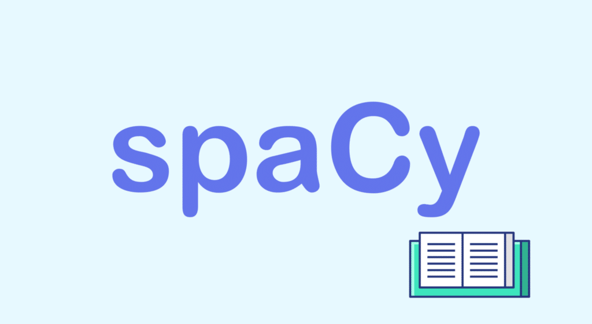

```{r setup, include=FALSE}
knitr::opts_chunk$set(eval=TRUE, include=TRUE, cache=TRUE)
library(reticulate)
use_condaenv("sentimentF23")
```

```{python include=FALSE}
import nltk
```


```{css echo=FALSE}
.pull-left {
  float: left;
  width: 44%;
}
.pull-right {
  float: right;
  width: 44%;
}
.pull-right ~ p {
  clear: both;
}


.pull-left-wide {
  float: left;
  width: 66%;
}
.pull-right-wide {
  float: right;
  width: 66%;
}
.pull-right-wide ~ p {
  clear: both;
}

.pull-left-narrow {
  float: left;
  width: 30%;
}
.pull-right-narrow {
  float: right;
  width: 30%;
}

.small123 {
  font-size: 0.80em;
}

.large123 {
  font-size: 2em;
}

.red {
  color: red
}
```

# Last time
.pull-left[
- Lexical Resources
- Finn Årup Nielsen 
- Basic workings of NLTK
- Coding challenge: Working with Text Data
]

.pull-right[

]

---
# Today's lecture
.pull-left[
- We can understand many NLP tasks as classification tasks
- Today mainly 'structural' classification 
- Based on understanding structure of language
- spaCy library 
- Zero-shot classificaiton using Transformers
]

.pull-right[

]

---
# A look insight WordNet

.pull-left[
```{python}
from nltk.corpus import wordnet as wn

# Synonomym names
wn.synsets('motorcar')

# Synonyms
wn.synset('car.n.01').lemma_names()
```
]


.pull-right[

]

#### Example
> the boy's cars are different colors 
> $\Rightarrow$ the boy car be differ color

---
# spaCy

.red[### Why is it we don't just stick to NLTK?]

.pull-left[

1. spaCy is a streamlined NLP library
  
2. Language Models: spaCy vs. NLTK:
  + spaCy provides pre-trained language models
  + NLTK is more flexible
  
3. Efficiency and Ease of Use: spaCy vs. NLTK:

]


.pull-right[

]

---
# Tokenization in NLTK
```{python}
# Import NLTK and download relevant resources (if not already done in previous lectures)
import nltk

# Download the NLTK stopwords corpus
nltk.download("stopwords")

# Example: Tokenization using NLTK (recap)
from nltk.tokenize import word_tokenize

text = "Natural language processing is a subfield of artificial intelligence."
tokens = word_tokenize(text)
print(tokens)

```

---
# Tokenizaiton in spaCy
```{python}
# Import spaCy and load the English language model
import spacy

nlp = spacy.load("en_core_web_sm")

# Tokenization using spaCy
text = "spaCy is a powerful NLP library."
doc = nlp(text)

# Extract tokens using spaCy
tokens = [token.text for token in doc]
print(tokens)

```


---
# The OG NLP classification problem

.pull-left[
- We want to identify parts of speach
- One simple apporach is ***Part of Speach***-tagging (*POS*) 
- spaCy does this at a high level based on an underlying model. Here [*en_core_web_sm*](https://spacy.io/models/en)
]

.pull-right[
.small123[
```{python echo=FALSE}
# Import spaCy and load the English language model
import spacy
nlp = spacy.load("en_core_web_sm")
```


```{python}
text = "The quick brown fox jumps over the lazy dog."
doc = nlp(text)

# Extract tokens and their part-of-speech tags using spaCy
pos_tags = [(token.text, token.pos_) for token in doc]

```

```{r echo=FALSE, message=FALSE, warning=FALSE}
library(foreach)
library(tidyverse)
foreach(i = py$pos_tags, .combine = "rbind") %do% {
  x = unlist(i)
  names(x) = c("Token", "Tag")
  x
} %>% 
  data.frame() %>%
  remove_rownames() %>% 
  knitr::kable()
```

]
]

---
# NLTK solution

```{python}
from nltk import word_tokenize, pos_tag

# Sample sentence
sentence = "NLTK is a leading platform for building Python programs."

# Tokenize the sentence
words = word_tokenize(sentence)

# Perform PoS tagging
tags = pos_tag(words)

# Print the PoS tags
print(tags)

```


---
# PoS tagging coding examples
[PoS example 1: Simple PoS summaries](https://github.com/christianvedels/News_and_Market_Sentiment_Analytics/blob/main/Lecture%203%20-%20Classification%20pt%201/Code/PoS_example1.py)  

[PoS example 2: News summary PoS](https://github.com/christianvedels/News_and_Market_Sentiment_Analytics/blob/main/Lecture%203%20-%20Classification%20pt%201/Code/PoS_example2.py)

[PoS example 3: Tweet sentiments](https://github.com/christianvedels/News_and_Market_Sentiment_Analytics/blob/main/Lecture%203%20-%20Classification%20pt%201/Code/PoS_example3.py)

---
# One shot classificaiton
#### Once again:
- What we learn here is useful 
- But we can do some things much more efficiently 
- While loosing our understanding of what is happening 

---
class: inverse, middle
# Coding challenge: 
## Detecting emotions with zero shot classification
[Click here to submit](https://forms.gle/WmSEkZn8WH1fiDjE6 )

```{r echo=FALSE}
library(countdown)
source("../000_Misc_functions_for_slides.R")
vertical = 0.25
dist = 0.15

countdown(
  minutes = 35,
  seconds = 0,
  right = 0,
  top = ToPct(vertical)
)
# countdown(
#   minutes = 25,
#   seconds = 0,
#   right = 0,
#   top = ToPct(vertical + dist)
# )
```


