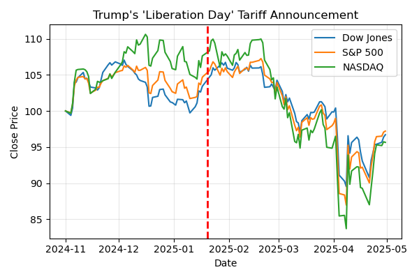
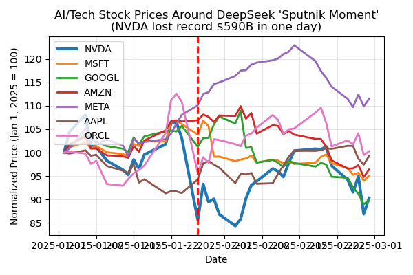
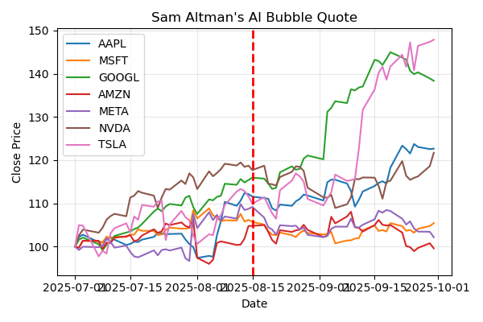
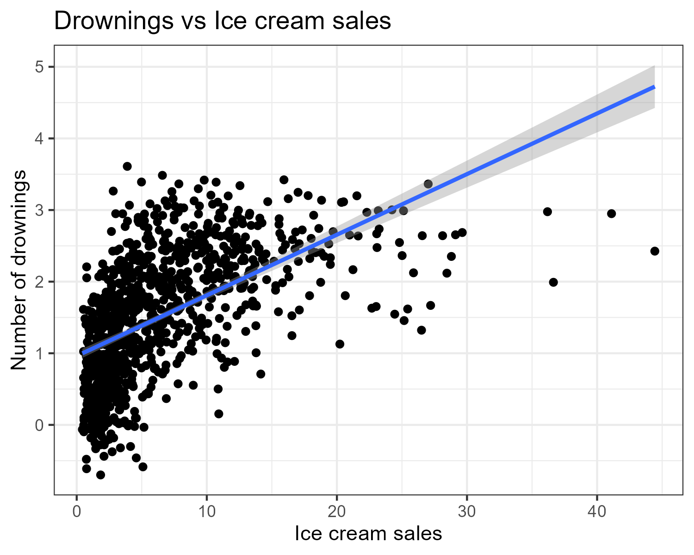
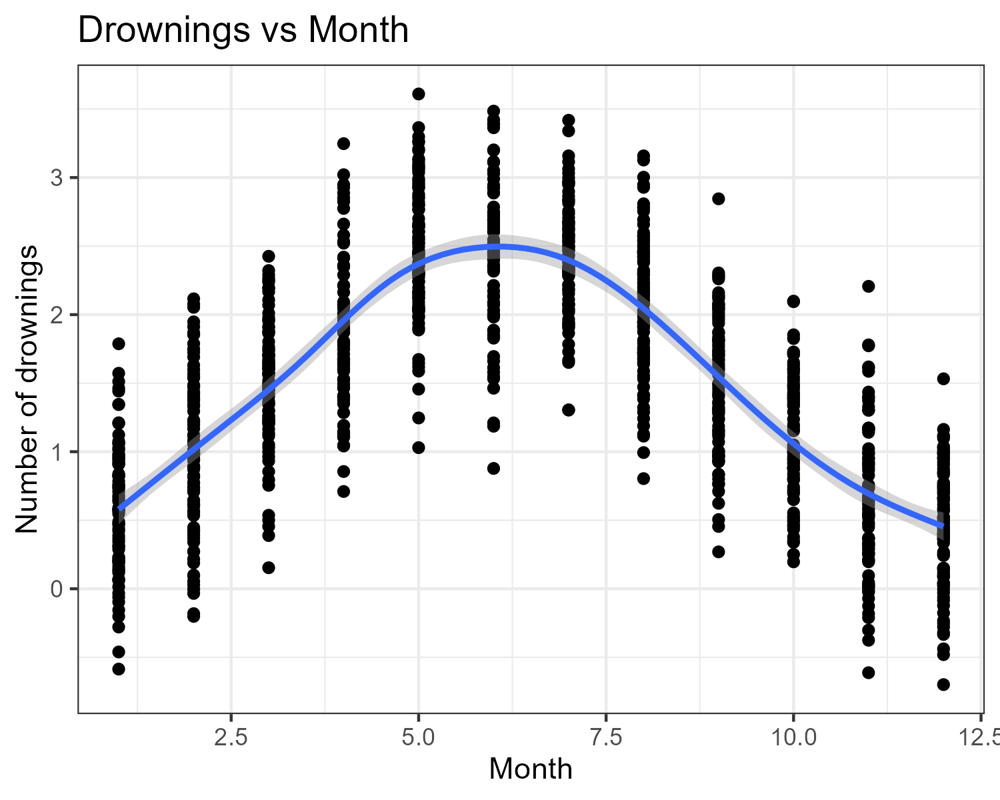
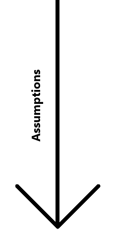
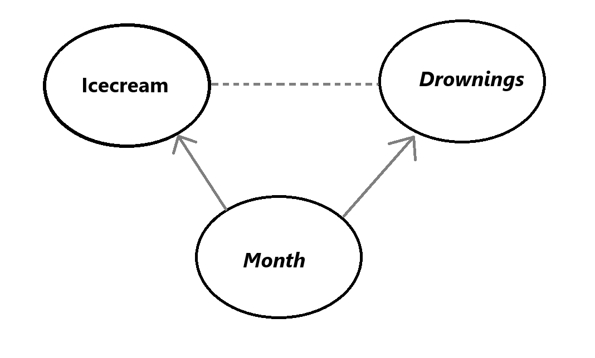

```{r xaringan-panelset, echo=FALSE}
xaringanExtra::use_panelset()
```

```{r xaringan-tile-view, echo=FALSE}
xaringanExtra::use_tile_view()
```

```{r xaringanExtra, echo = FALSE}
xaringanExtra::use_progress_bar(color = "#808080", location = "top")
```

```{r setup, include=FALSE}
knitr::opts_chunk$set(eval=TRUE, include=TRUE, cache=FALSE)
library(reticulate)
use_condaenv("sentimentF25")
```

```{python include=FALSE}
def print_it(x):
  for i in x: print(i)
```


```{css echo=FALSE}
.pull-left {
  float: left;
  width: 44%;
}
.pull-right {
  float: right;
  width: 44%;
}
.pull-right ~ p {
  clear: both;
}


.pull-left-wide {
  float: left;
  width: 66%;
}
.pull-right-wide {
  float: right;
  width: 66%;
}
.pull-right-wide ~ p {
  clear: both;
}

.pull-left-narrow {
  float: left;
  width: 30%;
}
.pull-right-narrow {
  float: right;
  width: 30%;
}

.small123 {
  font-size: 0.80em;
}

.large123 {
  font-size: 2em;
}

.red {
  color: red
}
```

# Last time

.pull-left[
- Tokenization and embedding spaces  
- *Coding challenge:* zero-shot sentiment classifier with embeddings
]

.pull-right-narrow[


]

---

# Today's lecture

.pull-left[
- Why **causality** in news & markets?  
- Directed Acyclic Graphs (DAGs)  
- **d-separation** and conditional independence  
- Time series: AR and MA models  
- **Granger causality**  
- Coding challenge: data-driven causal analysis
]

???

- You can say: “Today we’ll mostly stay on intuition + a few key equations.”
- Next: three concrete news shocks to motivate why causality matters.

---

class: middle
# Three recent news shocks

.pull-left[
1. Trump’s **“Liberation Day”** tariff announcement  
2. The **DeepSeek** AI “Sputnik moment”  
3. Sam Altman’s **AI bubble** comments

Each looks like *news → market reaction*.

Question we’ll keep asking:

> What is *actually* causing what in these pictures?

]

.pull-right-narrow[
.small123[
We’ll look at three small scripts:

- [`Code/liberation_day.py`](https://github.com/christianvedels/News_and_Market_Sentiment_Analytics/blob/main/Lecture%205%20-%20Causality/Code/liberation_day.py)  
- [`Code/deepseek.py`](https://github.com/christianvedels/News_and_Market_Sentiment_Analytics/blob/main/Lecture%205%20-%20Causality/Code/deepseek.py)
- [`Code/technews_and_AI_stocks.py`](https://github.com/christianvedels/News_and_Market_Sentiment_Analytics/blob/main/Lecture%205%20-%20Causality/Code/technews_and_AI_stocks.py)
]
]

???

- Briefly say when each happened and what the headlines were.
- Tell them: “All three plots you’re about to see are generated by those Python scripts in the repo.”

---

class: middle
# 1. Trump's "Liberation Day"

.pull-left[
- New tariff announcement (“Liberation Day”)  
- Broad US indices around the date

- Code: [`Code/liberation_day.py`](https://github.com/christianvedels/News_and_Market_Sentiment_Analytics/blob/main/Lecture%205%20-%20Causality/Code/liberation_day.py)  

]

.pull-right[

]

???

- Ask: "If I only show you this picture, what story do you tell?"
- Likely answer: tariffs → future growth fears → indices drift down.
- Flag that we don’t yet know if it’s *tariffs directly* or global conditions, Fed expectations, etc.

---

class: middle
# 2. DeepSeek "Sputnik moment"

.pull-left[
- Chinese AI startup releases ultra-cheap model  
- NVDA loses record \$590B in one day  

- Code: [`Code/deepseek.py`](https://github.com/christianvedels/News_and_Market_Sentiment_Analytics/blob/main/Lecture%205%20-%20Causality/Code/deepseek.py)
]

.pull-right[

]

???

- Point to NVDA (thick line) vs others.
- Ask: “Does this plot prove DeepSeek *caused* the drop? What else might be going on?”
- Mention we’ll later think about common shocks, expectations, and feedback.

---

class: middle
# 3. Sam Altman on the AI bubble

.pull-left[
- Sam Altman publicly worries about an **AI bubble**  
- Magnificent 7 (AI-heavy tech) around that date

- Code: [`Code/technews_and_AI_stocks.py`](https://github.com/christianvedels/News_and_Market_Sentiment_Analytics/blob/main/Lecture%205%20-%20Causality/Code/technews_and_AI_stocks.py)
]

.pull-right[

]

???

- Highlight that here prices don’t obviously crash on the quote.
- Useful contrast: strong narrative, weaker *visual* reaction.
- Sets up the idea that news and prices can move together, but causality isn’t obvious.

---

class: middle
# From pictures to causal questions

.pull-left-wide[
In all three cases we informally say:

> "News moved the market."

But many rival stories fit the same plots:

- News $\to$ prices  
- Prices $\to$ news  
- Macro / liquidity $\to$ both

Today we’ll:

- Use **DAGs** and **d-separation** to formalise these stories  
- Use **AR/MA** models and **Granger tests** to ask:

  $$\text{Do past headlines help predict returns?}$$
]


???

- Tie back explicitly to the three examples:
  - “Liberation Day tariffs”, “DeepSeek shock”, “Altman bubble quote”.
- Say you’ll revisit them when talking about DAGs and Granger causality.

---
<br>
<br>
# Toy example: Ice cream and drowning

.pull-left[
- Classic summer data set:

  - $X_t$: ice cream sales  
  - $Y_t$: drowning accidents

- In the toy data:
  - As $X_t$ goes up, $Y_t$ tends to go up

- Question:

  > Does buying ice cream **cause** drowning?
  
]

--

.pull-right[

.panelset[
.panel[.panel-name[Plot 1]

]

.panel[.panel-name[Plot 2]

]

]


]

---
# Simple regression results

```{r}
library(fixest)
data = read.csv("Code/Icecream_kills.csv")
mod1 = feols(drownings ~ icecream, data=data)
mod2 = feols(drownings ~ icecream | month, data=data)
etable(mod1, mod2)
```


---
class: middle, inverse

# Causality: Why care?

- If you get good enough you can do **Causal Inference**
- With the introduction: You can do a sniff test on stories:
  + "Does it make sense that X causes Y?"
  + "Could there be something else going on?"
  
---
class: middle
# Causal hierarchy (Pearl’s ladder) 
### *Importantly: You cannot move up the ladder without assumptions*

.pull-left-wide[
.pull-left-narrow[

]

.pull-right-wide[
1. **Association**  
   - $P(Y \mid X)$  
   - "What tends to go together?"

2. **Intervention**  
   - $P(Y \mid \text{do}(X))$  
   - "What happens if we **force** $X$?"

3. **Counterfactuals**  
   - $P(Y_x \mid X', Y')$  
   - "What **would have** happened if ...?"
]


]

--

.pull-right-narrow[
Our regression gives:

  $$P(Y \mid X)$$

But we *want*:

  $$P(Y \mid \text{do}(X))$$

In words:

  > If we forced ice cream sales up,  
  > would drownings go up?
  
]

???
- Stress: statistics alone gives you level 1 by default.
- Causal inference is about moving from $P(Y\mid X)$ to $P(Y\mid \text{do}(X))$ using assumptions and structure.
  
---
class: middle
# Enter DAGs

.pull-left-wide[
- A **Directed Acyclic Graph (DAG)**:

  - Nodes = variables  
  - Arrows = causal influence

- For ice cream:

  - $M \rightarrow X$  
  - $M \rightarrow Y$  
  - No arrow $X \rightarrow Y$
  
  
- *Lacking arrows encode our assumptions*
]

.pull-right-narrow[

]

???
- Say explicitly: “This is our *story* about the world, not something the data automatically know.”
- Highlight that **missing** arrows are strong assumptions too.
- Point out that $M$ is a confounder: common cause of both $X$ and $Y$.


---
class: middle
# Canonical structures

.pull-left[
1. **Chain** (mediator)  

   $$X \rightarrow Z \rightarrow Y$$

2. **Fork** (common cause)  

   $$X \leftarrow Z \rightarrow Y$$

3. **Collider** (common effect)  

   $$X \rightarrow Z \leftarrow Y$$
]

.pull-right-narrow[
- Ice cream example:

  $$X \leftarrow M \rightarrow Y$$

- This is a **fork**:

  - $M$ causes both $X$ and $Y$  
  - Confounding if $M$ is ignored
]

???
- Quickly sketch the three patterns on the board.
- Ask: "Which one fits ice cream & drowning?" --> the fork.

---
class: middle
# Central trick

> *Under some conditions we can estimate $P(Y \mid \text{do}(X))$ from observational quantities.*

.pull-left-wide[

- Idea: **block the backdoor paths** from $X$ to $Y$

- Find a set of variables $Z$ such that:
  - $Z$ d-separates $X$ and $Y$ when we ignore arrows  
    **out of** $X$ (no open backdoor paths)

- Then we can identify:

  $$P(Y \mid \text{do}(X)) = \sum_z P(Y \mid X, Z=z)\,P(Z=z)$$

- Ice cream example:
  - $Z = \{M\}$ (month)
  - Controlling for $M$ removes the spurious  
    $X \leftarrow M \rightarrow Y$ path
]

???

- Call this (informally) the **backdoor criterion**.
- Link back to the fixed-effects regression:
  - With month FE, the ice-cream coefficient moves toward the *causal* effect (≈0 here).
- Flag that in the news & markets setting, our main challenge is choosing a sensible $Z$.

---
class: middle
# d-separation (graphical independence)

.pull-left[
Let $X$, $Y$ and $Z$ be (sets of) nodes in a DAG.

We say $X$ and $Y$ are d-separated by $Z$
if **every path** between any node in $X$ and any node in $Y$ is **blocked** when we condition on $Z$.

A path is **blocked** if it contains at least one node that blocks it, using these rules:
]

.pull-right-narrow[
- **Chain / fork**  

  $$X \rightarrow M \rightarrow Y, \quad
    X \leftarrow M \rightarrow Y$$  

  Path is blocked if we **condition on $M$**.

- **Collider**  

  $$X \rightarrow M \leftarrow Y$$  

  Path is blocked if we do **not** condition on $M$  
  or any descendant of $M$.  
  Conditioning on a collider **opens** the path.
]

???

- Emphasise: d-separation is a purely **graphical** criterion.
- If the DAG is correct, d-separation corresponds to (conditional) **independence** in the data.
- This is what lets us use the graph to choose adjustment sets for causal effects.


---
class: middle
# Takeaways (so far)

.pull-left-wide[
1. **Causal structures are assumptions**

   - Every story about you data implies a DAG
   - Data can support or contradict it indirectly,  
     but you can’t “prove” the arrows from correlations alone  
   - (Speculation: some causal structure might **emerge** in very large ML systems, but we’re not there yet in this course)

2. **DAGs are thinking tools**

   - Force you to say what you believe causes what  
   - Let you spot **confounders**, **colliders**, and bad controls  
   - With d-separation, you can find sensible adjustment sets to turn some $P(Y \mid X, Z)$ into $P(Y \mid do(X))$
]

.pull-right-narrow[
3. **Where to read more**

   - Judea Pearl (2009): *Causality* (technical)
   - Judea Pearl, Madelyn Glymour, Nicholas P. Jewell (2016): *Causal Inference in Statistics: A Primer* (intro)
   - Judea Pearl (2018): *The Book of Why* (popular science)
   - Scott Cunningham (2021): *The Mixtape* (applied econ focus)

.small123[
Same core ideas you’ve seen today:  
DAGs, d-separation, and the gap between $P(Y\mid X)$ and $P(Y\mid do(X))$.
]
]

???

- Stress point 1: the graph is never “estimated” by OLS here; it’s a structured way to write down assumptions.
- Point 2: connect back to ice cream + drownings and the three market news stories.
- Point 3: say which book is closest to this course (probably Mixtape + What If for their style).


---
class: middle
# Exercise 1: Confounder (fork)

.pull-left[
**Story**

- $X$: Ice cream sales  
- $Y$: Drowning accidents  
- $M$: Month

$M$ affects both $X$ and $Y$.

**Tasks**

1. Draw a DAG for $(X, Y, M)$  
2. Find a d-sep of *X* and *Y*
]


???
- Expected DAG: $X \leftarrow M \rightarrow Y$ (fork).
- Answer:  
  - (a) Not d-separated → associated.  
  - (b) d-separated by $M$ → $X \perp Y \mid M$.
  
  
---
class: middle
# Exercise 2: Mediator (chain)

.pull-left[
**Story**

- $X$: New surprisingly good numbers on inflation
- $M$: Investor optimism  
- $Y$: Stock index return  

You believe:

- News changes optimism
- Optimism moves the index

**Tasks**

1. Draw a DAG for $(X, M, Y)$  
2. Decide if $X$ and $Y$ are d-separated:

   - (a) Given **nothing**  
   - (b) Given $M$
]

.pull-right-narrow[
**Question**

- Do $X$ and $Y$ remain associated  
  when we **adjust for** $M$?
- Would we get the effect of $X$ on $Y$?
]

???
- Expected DAG: $X \rightarrow M \rightarrow Y$ (chain).
- Answer:  
  - (a) Not d-separated → $X$ and $Y$ associated.  
  - (b) d-separated by $M$ → $X \perp Y \mid M$.
- Good moment to mention that conditioning on a mediator “blocks” total effect and leaves direct effect (if any).

---
class: middle
# Exercise 3: Collider

.pull-left-wide[

- $X$: true product quality  
- $Y$: marketing spend  
- $Z$: "featured on TechNews front page"

Editors feature firms that are:

- very high quality **or**  
- very heavy on marketing


]

.pull-right-narrow[
**Questions**

- Does more marketing spending *cause* better/worse products?
]

???

So both $X$ and $Y$ increase $P(Z=1)$:

$$X \rightarrow Z \leftarrow Y$$

**What happens if we condition on $Z=1$?**

- In the full population:  
  $X$ and $Y$ are (roughly) independent

- Among featured firms ($Z=1$):

  - High $X$ firms don't need big $Y$  
  - High $Y$ firms can get by with low $X$

- We see a **negative correlation** and might conclude:

> "Among featured firms, more marketing means worse products."

This is a spurious conclusion from  
**conditioning on a collider**.

- On the board:  
  1. Draw a round cloud for $(X,Y)$ (no correlation).  
  2. Draw a diagonal threshold, keep only points above it ($Z=1$).  
  3. Show that the remaining points line up with a negative slope.
- Emphasise: this is about **selection**; many empirical datasets are implicitly "Z=1 only".


---
class: middle
# From DAGs to time series

.pull-left[
- So far:
  - Static DAGs  
  - Ice cream vs drownings  
  - News vs returns as **cross-sectional snapshots**

- Next step:
  - Markets and news are **time series**  
  - Yesterday’s values matter for today
]

--

.pull-right-narrow[
### Goal

  > Add **time** to our causal thinking and see how to test "X helps predict Y"

- Yet again, only an introduction

]

???

- Transition line: "Now let’s add the $t$-index back in and think about sequences, not just one-day plots."


---
class: middle
# AR and MA models: what they do

.pull-left[
**Autoregressive (AR)**

- $Y_t$ depends on its **own past**

  $$Y_t = \phi_1 Y_{t-1} + \dots + \phi_p Y_{t-p} + \varepsilon_t$$

- Captures **momentum / mean reversion**

**Moving average (MA)**

- $Y_t$ depends on **past shocks**

  $$Y_t = \mu + \varepsilon_t + \theta_1 \varepsilon_{t-1} + \dots$$

- Captures **short-lived shock effects**
]

.pull-right-narrow[
We’ll:

- Show a simple AR(1) and MA(1) in code  
- Fit them to a returns series  
- Use them as a **baseline** before we add news/sentiment
]

???

- Emphasise: “These are just glorified linear regressions on lags.”
- Mention that you’ll keep it at AR(1)/MA(1) for intuition, not full ARIMA theory.


---
class: middle
# Granger causality: idea

.pull-left[
Question:

> Does series $X_t$ help predict $Y_t$  
> **beyond** what past $Y$ already tells us?

Definition (informal):

- $X$ **Granger-causes** $Y$ if  
  including past $X$ improves forecasts of $Y$.

We’ll:

- Compare models with and without lagged $X$  
- Use `statsmodels`’ Granger test
]

.pull-right-narrow[
Links to earlier part:

- DAG story: “news $\to$ returns” vs “returns $\to$ news”
- Granger story:
  - Does past news predict returns?  
  - Does past returns predict news?

- Granger $\neq$ full causal proof,  
  but it’s a **useful diagnostic** in time series.
]

???

- Flag explicitly: “This is a *forecast-based* notion of causality.”
- Good time to remind them: “Cause must come before effect in time.”


---
class: inverse, middle
# Coding challenge: 
## [News and Market Sentiment Analysis](https://github.com/christianvedels/News_and_Market_Sentiment_Analytics/blob/main/Lecture%205%20-%20Causality/coding_challenge_5.md)


