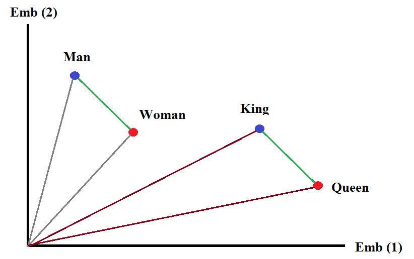

```{r setup, include=FALSE}
knitr::opts_chunk$set(eval=TRUE, include=TRUE, cache=FALSE)
library(reticulate)
use_condaenv("sentimentF23")
```

```{python include=FALSE}
def print_it(x):
  for i in x: print(i)
```


```{css echo=FALSE}
.pull-left {
  float: left;
  width: 44%;
}
.pull-right {
  float: right;
  width: 44%;
}
.pull-right ~ p {
  clear: both;
}


.pull-left-wide {
  float: left;
  width: 66%;
}
.pull-right-wide {
  float: right;
  width: 66%;
}
.pull-right-wide ~ p {
  clear: both;
}

.pull-left-narrow {
  float: left;
  width: 30%;
}
.pull-right-narrow {
  float: right;
  width: 30%;
}

.small123 {
  font-size: 0.80em;
}

.large123 {
  font-size: 2em;
}

.red {
  color: red
}
```

# Last time
.pull-left[
- SoTA text classification in news and market sentiments analytics
- Off-the shelf models
- Transfer learning
]

.pull-right-narrow[

]

---
class: middle
# Today's lecture
.pull-left[
- Tokenization
- Embedding space
- The nuts and bolts of modern NLP
- Guest lecture: Julius Koschnick, Assistant Professor: "NLP caught in the wild"
]

.pull-right-narrow[

]


---
class: middle
# Tokenization

.pull-left[
- The problem: Text is not numbers

]

.pull-right[
### Example
- "what is this sentence?"

Some options:
  - Characters level tokenizaiton `[ord(char) for char in text]`: `[119, 104, 97, 116, 32, 105, 115, ...]` 
  - Word-level tokenization `["what", "is", "this", "sentence", "?"]`: `[5, 3, 2, 4, 99]`
  - Subword-level tokenization `["what", "is", "this", "sen", "##tence", "?"]`: `[5, 3, 4, 7, 1, 11]`
]

---
class: middle
# Tokenization in practice

```{python}
import spacy
nlp = spacy.load("en_core_web_sm") # Small Eng. model
```

```{python}

print_it(nlp.pipeline) # Contains the basic pipeline
```

---
class: middle
# Working with very large data

```{python}
# The pipeline can be heavy for very large data
# We can disable things we don't need
nlp = spacy.load("en_core_web_sm", disable=["parser","ner"])
```

```{python}
# GPU can also help speeding up things
if spacy.prefer_gpu():
  print("Working on GPU")
else:
  print("No GPU found, working on CPU")
```

---
class: middle
# Tangent: Nanmed Entity Recognition (NER)
.pull-left[
*Fisher Asset Management LLC lessened its holdings in Novo Nordisk A/S (NYSE:NVO - Free Report) by 0.5% during the third quarter, according to the company in its most recent Form 13F filing with the Securities & Exchange Commission. The institutional investor owned 13,305,474 shares of the company's stock after selling 65,153 shares during the quarter. Fisher Asset Management LLC owned 0.30% of Novo Nordisk A/S worth $1,584,283,000 as of its most recent SEC filing.*

```{python, eval=FALSE}
text = """
    Fisher Asset Management LLC lessened its holdings in Novo Nordisk A/S (NYSE:NVO - Free Report) by 0.5% during the third quarter, according to the company in its most recent Form 13F filing with the Securities & Exchange Commission. The institutional investor owned 13,305,474 shares of the company's stock after selling 65,153 shares during the quarter. Fisher Asset Management LLC owned 0.30% of Novo Nordisk A/S worth $1,584,283,000 as of its most recent SEC filing.
  """
# Source: https://www.marketbeat.com/instant-alerts/fisher-asset-management-llc-sells-65153-shares-of-novo-nordisk-as-nysenvo-2024-11-25/
import spacy
nlp = spacy.load("en_core_web_sm")
doc = nlp(text)
spacy.displacy.render(doc, style ='ent')
```
]

--

.pull-right[
.small123[
<div class="entities" style="line-height: 2.5; direction: ltr"></br>    <mark class="entity" style="background: #7aecec; padding: 0.45em 0.6em; margin: 0 0.25em; line-height: 1; border-radius: 0.35em;">    Fisher Asset Management    <span style="font-size: 0.8em; font-weight: bold; line-height: 1; border-radius: 0.35em; vertical-align: middle; margin-left: 0.5rem">ORG</span></mark> LLC lessened its holdings in <mark class="entity" style="background: #7aecec; padding: 0.45em 0.6em; margin: 0 0.25em; line-height: 1; border-radius: 0.35em;">    Novo Nordisk A/S    <span style="font-size: 0.8em; font-weight: bold; line-height: 1; border-radius: 0.35em; vertical-align: middle; margin-left: 0.5rem">ORG</span></mark> (<mark class="entity" style="background: #7aecec; padding: 0.45em 0.6em; margin: 0 0.25em; line-height: 1; border-radius: 0.35em;">    NYSE    <span style="font-size: 0.8em; font-weight: bold; line-height: 1; border-radius: 0.35em; vertical-align: middle; margin-left: 0.5rem">ORG</span></mark>:<mark class="entity" style="background: #7aecec; padding: 0.45em 0.6em; margin: 0 0.25em; line-height: 1; border-radius: 0.35em;">    NVO - Free Report    <span style="font-size: 0.8em; font-weight: bold; line-height: 1; border-radius: 0.35em; vertical-align: middle; margin-left: 0.5rem">ORG</span></mark>) by <mark class="entity" style="background: #e4e7d2; padding: 0.45em 0.6em; margin: 0 0.25em; line-height: 1; border-radius: 0.35em;">    0.5%    <span style="font-size: 0.8em; font-weight: bold; line-height: 1; border-radius: 0.35em; vertical-align: middle; margin-left: 0.5rem">PERCENT</span></mark> during <mark class="entity" style="background: #bfe1d9; padding: 0.45em 0.6em; margin: 0 0.25em; line-height: 1; border-radius: 0.35em;">    the third quarter    <span style="font-size: 0.8em; font-weight: bold; line-height: 1; border-radius: 0.35em; vertical-align: middle; margin-left: 0.5rem">DATE</span></mark>, according to the company in its most recent <mark class="entity" style="background: #aa9cfc; padding: 0.45em 0.6em; margin: 0 0.25em; line-height: 1; border-radius: 0.35em;">    Form 13F    <span style="font-size: 0.8em; font-weight: bold; line-height: 1; border-radius: 0.35em; vertical-align: middle; margin-left: 0.5rem">PERSON</span></mark> filing with <mark class="entity" style="background: #7aecec; padding: 0.45em 0.6em; margin: 0 0.25em; line-height: 1; border-radius: 0.35em;">    the Securities &amp; Exchange Commission    <span style="font-size: 0.8em; font-weight: bold; line-height: 1; border-radius: 0.35em; vertical-align: middle; margin-left: 0.5rem">ORG</span></mark>. The institutional investor owned <mark class="entity" style="background: #e4e7d2; padding: 0.45em 0.6em; margin: 0 0.25em; line-height: 1; border-radius: 0.35em;">    13,305,474    <span style="font-size: 0.8em; font-weight: bold; line-height: 1; border-radius: 0.35em; vertical-align: middle; margin-left: 0.5rem">CARDINAL</span></mark> shares of the company\'s stock after selling <mark class="entity" style="background: #e4e7d2; padding: 0.45em 0.6em; margin: 0 0.25em; line-height: 1; border-radius: 0.35em;">    65,153    <span style="font-size: 0.8em; font-weight: bold; line-height: 1; border-radius: 0.35em; vertical-align: middle; margin-left: 0.5rem">CARDINAL</span></mark> shares during <mark class="entity" style="background: #bfe1d9; padding: 0.45em 0.6em; margin: 0 0.25em; line-height: 1; border-radius: 0.35em;">    the quarter    <span style="font-size: 0.8em; font-weight: bold; line-height: 1; border-radius: 0.35em; vertical-align: middle; margin-left: 0.5rem">DATE</span></mark>. <mark class="entity" style="background: #7aecec; padding: 0.45em 0.6em; margin: 0 0.25em; line-height: 1; border-radius: 0.35em;">    Fisher Asset Management    <span style="font-size: 0.8em; font-weight: bold; line-height: 1; border-radius: 0.35em; vertical-align: middle; margin-left: 0.5rem">ORG</span></mark> <mark class="entity" style="background: #7aecec; padding: 0.45em 0.6em; margin: 0 0.25em; line-height: 1; border-radius: 0.35em;">    LLC    <span style="font-size: 0.8em; font-weight: bold; line-height: 1; border-radius: 0.35em; vertical-align: middle; margin-left: 0.5rem">ORG</span></mark> owned <mark class="entity" style="background: #e4e7d2; padding: 0.45em 0.6em; margin: 0 0.25em; line-height: 1; border-radius: 0.35em;">    0.30%    <span style="font-size: 0.8em; font-weight: bold; line-height: 1; border-radius: 0.35em; vertical-align: middle; margin-left: 0.5rem">PERCENT</span></mark> of <mark class="entity" style="background: #7aecec; padding: 0.45em 0.6em; margin: 0 0.25em; line-height: 1; border-radius: 0.35em;">    Novo Nordisk A/S    <span style="font-size: 0.8em; font-weight: bold; line-height: 1; border-radius: 0.35em; vertical-align: middle; margin-left: 0.5rem">ORG</span></mark> worth $<mark class="entity" style="background: #e4e7d2; padding: 0.45em 0.6em; margin: 0 0.25em; line-height: 1; border-radius: 0.35em;">    1,584,283,000    <span style="font-size: 0.8em; font-weight: bold; line-height: 1; border-radius: 0.35em; vertical-align: middle; margin-left: 0.5rem">MONEY</span></mark> as of its most recent <mark class="entity" style="background: #7aecec; padding: 0.45em 0.6em; margin: 0 0.25em; line-height: 1; border-radius: 0.35em;">    SEC    <span style="font-size: 0.8em; font-weight: bold; line-height: 1; border-radius: 0.35em; vertical-align: middle; margin-left: 0.5rem">ORG</span></mark> filing.</br>  </div>
]
]

---
# Embeddings
### One step back: What problem are we trying to solve?
--

### Original problem: Text similarity
Is text $x$ 'equal' to text $y$?
--

## Text similarity measures

- String distance* 
- Document Term Matrix Distance
- Embedding distance

.footnote[
$^*$ covered in more detail next time
]

---
class: middle
# Basic similarity measures
.pull-left-narrow[
- String distance (divergence*): Hamming, Levenstein, Jaro-Winkler
- More one these next time
- For now just an example on the right
]


.pull-right-wide[
.small123[
```{python spelling-correction}
from nltk.metrics import edit_distance

# Original text
text = "The cat sat on the met."

# Misspelled word
misspelled_word = "met"

# Candidate correct words
correct_words = ["mat", "mete", "meet", "meat"]

# Select the word with the minimum Levenshtein Distance as the correction
closest_word = min(correct_words, key=lambda word: edit_distance(misspelled_word, word))

print(f"Closest Correct Spelling: {closest_word}")

```
]
]

.footnote[
$^*$ formally speaking it is a divergence since it is not symmetrical.
]

---
class: middle
# Levensthein distance

.pull-left[
- Most common basic string distance measure 
- $O(mn)$ complexity - you can run it 
- Consists of edits: deletions, insertions, substitutions 
]


.pull-right[
**Levensthein distance**  
kitten $\rightarrow$ sitting
1. sitten (substitution of 's' for 'k')
2. sittin (substitution of 'i' for 'e')
3. sitting (insertion of 'g')
]

---
class: middle
# 10 problems with basic string similarity measures
```{r eval=FALSE, include=FALSE}
word_pairs = data.frame(
  word1 = c("Silent", "Wealthy", "Start", "Help", "Angry", "Happy", "Big", "Small", "Tired", "Friend"),
  word2 = c("Quiet", "Affluent", "Commence", "Assist", "Furious", "Joyful", "Enormous", "Tiny", "Exhausted", "Companion")
)
for(i in 1:NROW(word_pairs)){
  word_pairs$sim[i] = 1 - adist(word_pairs$word1[i], word_pairs$word2[i]) / max(nchar(word_pairs$word1[i]), nchar(word_pairs$word2[i]))
}
print(word_pairs)
```

1. Silent ↔ Quiet: 0.3333
2. Wealthy ↔ Affluent: 0.1250
3. Start ↔ Commence: 0.000
3. Help ↔ Assist: 0.000
4. Angry ↔ Furious: 0.000
5. Happy ↔ Joyful: 0.000
6. Big ↔ Enormous: 0.000
7. Small ↔ Tiny: 0.000
8. Tired ↔ Exhausted: 0.2222
9. Friend ↔ Companion: 0.1111


.footnote[
.small123[Similarity computed as the complement to Levenstein distance divided by the length of the longest string]
]

---
# Better similarity measure:

Let $S(x,y)$ be some similarity measure. $x$ and $y$ are some objects of interest, e.g. texts

We want to obey the following:
  - $S(x, y) = 1$ if $x=y$: The same text should be 1
  - $S(x, y) = -1$ if $x=-y$: Completely opposite texts should be -1
  - $S(x, y) = 0$ if $x \perp y$: Unrelated objects should be 0  
  
--
### Cosine similarity to the rescue 

If we can represent $v(x)$ and $v(y)$ as vectors, then $cos\left(\theta_{v(x),v(y)}\right)$ represents such a simiarity measure.

$$
S_C\left(v(x), v(y)\right) = \frac{v(x)\cdot v(y)}{|v(x)||v(y)|}
$$

---
# Cosine similarity

.pull-left[
### Intuition
- Function of the 'angle' between concepts 
- Things in the same 'direction' (0 degrees) are the same
- Orthogonal things (90 degrees) are unrelated 
- Opposites (180 degress) are opposites 

### Construction
- We need to turn text into vectors

- Two approaches:
  + Document Term Matrix (CountVectorizer in scikit learn)
  + Embeddings
]

.pull-right[


### DTM 
- "he is happy"
- "he is sad"

| Document | happy | he | is | sad |
|----------|-------|----|----|-----|
| Doc1     | 1     | 1  | 1  | 0   |
| Doc2     | 0     | 1  | 1  | 1   |

$v_1 = [1, 1, 1, 0],\: v_2 =[0,1,1,1]$

### Embedding space

- $f(text)$ which outputs the semantic 'meaning' of the sentece
- Turns out language models do this already. 
]

---
# Embeddings: The idea
.pull-left[
- Encode language such that semantics is encoded in vector operations
- Embedding vectors can be manipulated algebraically
- Example: `Emb(King) - Emb(Man) + Emb(Woman) = Emb(Queen)`
]

.pull-right[

]

---
# Example: 10 problems (from earlier)

.small123[
.pull-left[
```{python}
import spacy
from scipy.spatial.distance import cosine

# Load the SpaCy language model
nlp = spacy.load("en_core_web_lg")

# Define the word pairs
word_pairs = [
    ("Silent", "Quiet"),
    ("Wealthy", "Affluent"),
    ("Start", "Commence"),
    ("Help", "Assist"),
    ("Angry", "Furious"),
    ("Happy", "Joyful"),
    ("Big", "Enormous"),
    ("Small", "Tiny"),
    ("Tired", "Exhausted"),
    ("Friend", "Companion")
]

```
]
]

.small123[
.pull-right[
```{python, eval=FALSE}
# Compute cosine distances for each pair
results = []
for word1, word2 in word_pairs:
    vector1 = nlp(word1.lower()).vector
    vector2 = nlp(word2.lower()).vector
    distance = cosine(vector1, vector2)
    results.append((word1, word2, distance))
    
# Display results
for word1, word2, distance in results:
    print(f"{word1} ↔ {word2}: {distance:.4f}")
```
Silent ↔ Quiet: 0.4730  
Wealthy ↔ Affluent: 0.2832  
Start ↔ Commence: 0.4927  
Help ↔ Assist: 0.2155  
Angry ↔ Furious: 0.3772  
Happy ↔ Joyful: 0.4924  
Big ↔ Enormous: 0.4185  
Small ↔ Tiny: 0.3168  
Tired ↔ Exhausted: 0.3563  
Friend ↔ Companion: 0.5452  
]
]

---
class: middle
# Example: Farther - Man + Woman = Mother?
.small-123[
```{python eval=FALSE}
import spacy

# Load the SpaCy language model
nlp = spacy.load("en_core_web_lg")

# Vectors for the terms
vector_king = nlp("father").vector
vector_man = nlp("man").vector
vector_woman = nlp("woman").vector

# Perform the vector arithmetic
result_vector = vector_king - vector_man + vector_woman

# Find the closest word to the result vector
similar_words = nlp.vocab.vectors.most_similar(result_vector.reshape(1, -1), n=5)

# Output the closest words
for word_id, similarity in zip(similar_words[0][0], similar_words[2][0]):
    word = nlp.vocab.strings[word_id]
    print(f"{word}: {similarity:.4f}")
```
]

---
class: middle
# Example: Farther - Man + Woman = Mother?
### Result
```{python eval=FALSE}
mother: 0.8018
father: 0.7496
grandmother: 0.7310
birthmother: 0.7258
daugther: 0.7162
```

---
class: middle
# Example: Paris - France + Italy = Rome?
.small-123[
```{python eval=FALSE}
import spacy

# Load the SpaCy language model
nlp = spacy.load("en_core_web_lg")

# Vectors for the terms
vector_paris = nlp("Paris").vector
vector_france = nlp("France").vector
vector_italy = nlp("Italy").vector

# Perform the vector arithmetic
result_vector = vector_paris - vector_france + vector_italy

# Find the closest word to the result vector
similar_words = nlp.vocab.vectors.most_similar(result_vector.reshape(1, -1), n=5)

# Output the closest words
for word_id, similarity in zip(similar_words[0][0], similar_words[2][0]):
    word = nlp.vocab.strings[word_id]
    print(f"{word}: {similarity:.4f}")
```
]

---
class: middle
# Example: Paris - France + Italy = Rome?
### Result:
```{python eval=FALSE}
Paris: 0.7084
Milan: 0.6993
Bologna: 0.6938
Rome: 0.6836
Venice: 0.6710
```

---
class: middle
# Example: King - Man + woman = Queen?
.small-123[
```{python eval=FALSE}
import spacy

# Load the SpaCy language model
nlp = spacy.load("en_core_web_lg")

# Vectors for the terms
vector_king = nlp("king").vector
vector_man = nlp("man").vector
vector_woman = nlp("woman").vector

# Perform the vector arithmetic
result_vector = vector_king - vector_man + vector_woman

# Find the closest word to the result vector
similar_words = nlp.vocab.vectors.most_similar(result_vector.reshape(1, -1), n=20)

# Output the closest words
for word_id, similarity in zip(similar_words[0][0], similar_words[2][0]):
    word = nlp.vocab.strings[word_id]
    print(f"{word}: {similarity:.4f}")
```
]

---
class: middle
# Example: King - Man + woman = Queen?
### Result:
.pull-left[.small123[
```{python eval=FALSE}
1. king: 0.8490
2. kings: 0.7189
3. princes: 0.7097
4. consort: 0.7074
5. princeling: 0.7026
6. monarch: 0.6899
7. princelings: 0.6873
8. princesses: 0.6814
9. prince: 0.6563
10. kingship: 0.6498
```
]
]
.pull-right[.small123[
```{python eval=FALSE}
11. princess: 0.6481
12. ruler: 0.6450
13. consorts: 0.6377
14. kingi: 0.6362
15. princedom: 0.6355
16. rulers: 0.6347
17. kingii: 0.6259
18. enthronement: 0.6236
19. monarchical: 0.6206
*20. queen: 0.6178
```
]
]


---
class: middle
# The simple (extraordinary) function of embedding spaces

.pull-left[
- The embedding representation of a piece of text is a mathematical representation of the ***meaning*** of that piece of text
- This is one way of understanding large language models:
  + Encoder: Encodes the meaning of the input in the embedding space
  + Decoder: Since the meaning is represented, a decoder module can do important stuff with it e.g. predict next word, or classify the input
- But we can also do other kinds of arithmetic with ideas 

]


--

.pull-right[

### Use cases
- Compute measures of innovation 
  + Obvious feature in sentiment stock prediction)
- Drastically improve record linking ('John', 'Hans', 'Johannes')
- Build zero-shot classifiers
- Efficiently represent documents for RAG systems

]


---
class: middle
# Plan for the remaining 2 lectures:

### Lecture 6: Text similarity and record linking (and maybe topic models)
### Lecture 7: RAG systems and course evaluation
### Lecture 8: Exam workshop


---
class: inverse, middle
# Coding challenge: 
## [Building a zero-shot classifier](https://github.com/christianvedels/News_and_Market_Sentiment_Analytics/blob/main/Lecture%205%20-%20Tokenization%20and%20embeddings/Coding_challenge_lecture5.md)


