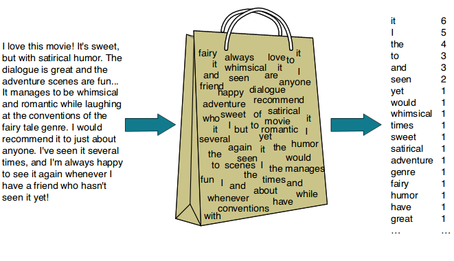
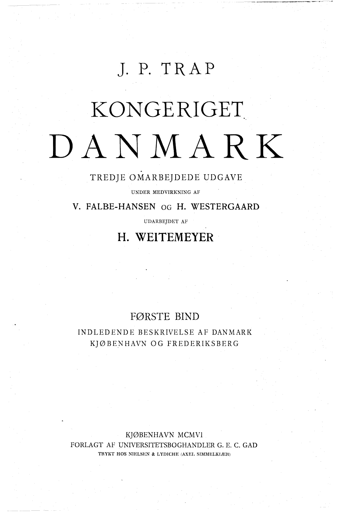
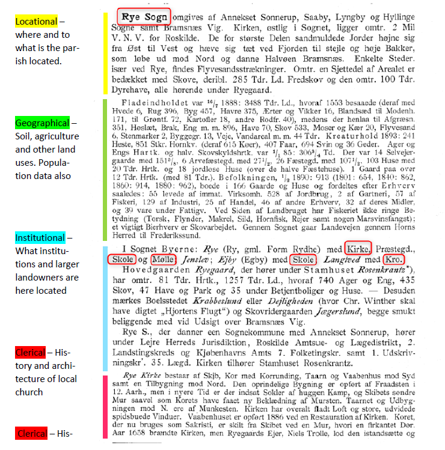
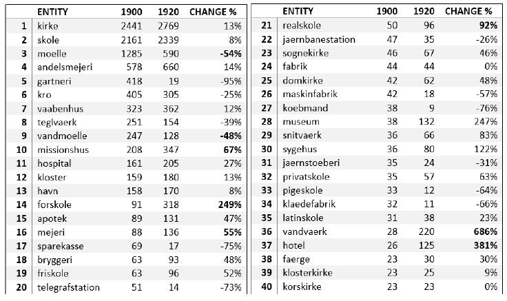
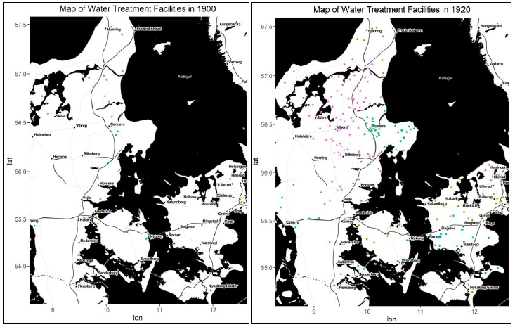
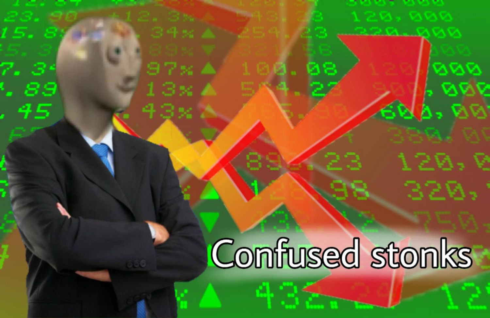

```{r setup, include=FALSE}
knitr::opts_chunk$set(eval=TRUE, include=TRUE, cache=FALSE)
library(reticulate)
use_condaenv("sentimentF23")
```

```{r xaringan-panelset, echo=FALSE}
xaringanExtra::use_panelset()
```

```{r xaringan-tile-view, echo=FALSE}
xaringanExtra::use_tile_view()
```

```{r xaringanExtra, echo = FALSE}
xaringanExtra::use_progress_bar(color = "#808080", location = "top")
```


```{css echo=FALSE}
.pull-left {
  float: left;
  width: 44%;
}
.pull-right {
  float: right;
  width: 44%;
}
.pull-right ~ p {
  clear: both;
}


.pull-left-wide {
  float: left;
  width: 66%;
}
.pull-right-wide {
  float: right;
  width: 66%;
}
.pull-right-wide ~ p {
  clear: both;
}

.pull-left-narrow {
  float: left;
  width: 30%;
}
.pull-right-narrow {
  float: right;
  width: 30%;
}

.small123 {
  font-size: 0.80em;
}

.large123 {
  font-size: 2em;
}

.red {
  color: red
}
```

# Last time
.pull-left[
- More standard classification approach
- Extracting features using NLP tools 
- Training data $\rightarrow$ prediction engine
- **Research example:** Automatic occupational classification
]

.pull-right[

]

---
# Today's lecture
.pull-left[
- Using grammar
- Named entity recognition
- Basic financial theory
]

.pull-right[

]


---
# Understanding and Utilizing Grammar

.pull-left[

- From bag(s) of words to sentence comprehension:

- Same words but very different meaning.

- One layer of abstraction below transformers.



]

.pull-right[
.small123[
### Examples
> a. *The scientists discovered a new species in the Amazon rainforest*  

> b. *The research paper highlighted that scientists discovered a new species in the Amazon rainforest*  

> c. *Sarah mentioned the research paper that highlighted scientists discovered a new species in the Amazon rainforest*  

> d. *I believe Sarah mentioned the research paper that highlighted scientists discovered a new species in the Amazon rainforest*
]
]
---
# Revisiting Basic Grammatical Ideas

.pull-left-narrow[
.small123[
- **Noun**
  - *Person, place, thing, or idea*
    - *Example: The **cat** is on the roof.*
- **Verb**
  - *Action or state of being*
    - *Example: The dog **barks** loudly.*
- **Adjective**
  - *Describes a noun*
    - *Example: She has a **beautiful** garden.*
- **Adverb**
  - *Modifies a verb, adjective, or other adverbs*
    - *Example: He speaks **loudly** and **clearly**.*
]

]

.pull-right-wide[
.small123[
```{python}
from nltk import pos_tag
from nltk.tokenize import word_tokenize

sentence = "The cat is on the roof."
tokens = word_tokenize(sentence)
pos_tags = pos_tag(tokens, tagset = 'universal')
for word, tag in pos_tags: # Pretty print
    print(f"{word: <15} {tag}")
```
]

.red[
***Can be used to build understanding***
]

]

---
# Note: We can also subcategorize e.g. verbs

| Form  | Category                | Tag  |
|-------|-------------------------|------|
| go    | base                    | VB   |
| goes  | 3rd singular present   | VBZ  |
| gone  | past participle         | VBN  |
| going | gerund                  | VBG  |
| went  | simple past             | VBD  |

---
# Parts of Speech

- **Noun Phrases**
  - *Group of words centered around a noun*
    - *Example: **The old book** on the shelf is valuable.*
- **Verb Phrases**
  - *Group of words centered around a verb*
    - *Example: The cat **is sleeping** peacefully.*
- **Sentence Structure**
  - *Subject, Predicate, Object*
    - *Example: **She** (subject) **ate** (verb) **the delicious cake** (object).*


---
# Chunkers: Extracting Phrases
.small123[
```{python}
from nltk import pos_tag, RegexpParser
from nltk.tokenize import word_tokenize

sentence = "The cat is on the roof."
tokens = word_tokenize(sentence)
pos_tags = pos_tag(tokens)

# Chunking with a simple grammar
grammar = r"""
  NP: {<DT>?<JJ>*<NN>}  # NP: Noun Phrase
  VP: {<VB.*><DT>?<JJ>*<NN|IN>}  # VP: Verb Phrase
"""
chunk_parser = RegexpParser(grammar)
chunks = chunk_parser.parse(pos_tags)

for subtree in chunks.subtrees():
    if subtree.label():
        print(subtree)
```
]
---
# Chunkers: Extracting Phrases (spaCy)
.small123[
```{python}
import spacy

# Load spaCy English model
nlp = spacy.load("en_core_web_sm")

# Example sentence
sentence = "Sarah mentioned the research paper that highlighted scientists discovered a new species in the Amazon rainforest."

# Process the sentence with spaCy
doc = nlp(sentence)

# Extract noun phrases and verb phrases
noun_phrases = [chunk.text for chunk in doc.noun_chunks]
verb_phrases = [token.text for token in doc if token.pos_ == 'VERB']

# Print the results
print("Noun Phrases:", noun_phrases)
print("Verb Phrases:", verb_phrases)
```
]

---
# Noun phrase chunking

.small123[
*From NLTK ch. 2.1*
]

---
# Named Entity Recognition (NER)

.pull-left-narrow[
.small123[
- **Definition**
  - *Identifying and classifying named entities in text*
- **Named Entities**
  - *Entities such as names, locations, organizations, etc.*
- **Importance**
  - *Extracting structured information from unstructured text*
- **Applications**
  - *Information retrieval, question answering, and more*
]
]

.pull-right-wide[
.red[
***NER enhances information extraction by identifying and classifying entities in text.***
]
]
---
# NER with NLTK
```{python}
from nltk import ne_chunk
# Named Entity Recognition (NER) with NLTK
ner_sentence = "Apple Inc. is located in Cupertino, California."
ner_tokens = word_tokenize(ner_sentence)
ner_pos_tags = pos_tag(ner_tokens, tagset='universal')
ner_tree = ne_chunk(ner_pos_tags)

print("\nNER Example:")
print(ner_tree)
```

---
# NER with spaCy

**spaCy Code**
```{python}
import spacy
nlp = spacy.load("en_core_web_sm")
doc = nlp("Apple Inc. is located in Cupertino, California.")
for ent in doc.ents:
    print(f"{ent.text} : {ent.label_} : {ent.label_}")
```
.red[
***spaCy streamlines NER with its pre-trained models, providing accurate entity recognition.***
]

---
# NER visualised
```{python results='asis'}
import spacy
from spacy import displacy

text = "When Sebastian Thrun started working on self-driving cars at Google in 2007, few people outside of the company took him seriously."

nlp = spacy.load("en_core_web_sm")
doc = nlp(text)
displacy.render(doc, style="ent")
```

---
.pull-left-narrow[
## Reading into the past
- Topography (Geographical encyclopedia)
- Contains a lot of information hidden in text
- ~2000 parishes: High spatial resolution
]

.footnote[
.small123[
**Source** master's thesis by Andreas S. Ravnholt (2021) "Reading into the past: A method for Digitalising Historical Documents using NER"
]

]

.pull-right-wide[
.small123[
.panelset[
.panel[.panel-name[Front page]

]
.panel[.panel-name[NER]

]
.panel[.panel-name[Stats]

]
.panel[.panel-name[Geography]

]

]
]
]


---
# Resolving the motivating example

.panelset[
.panel[.panel-name[Text]
.small123[
> a. *The scientists discovered a new species in the Amazon rainforest*  
> b. *The research paper highlighted that scientists discovered a new species in the Amazon rainforest*  
> c. *Sarah mentioned the research paper that highlighted scientists discovered a new species in the Amazon rainforest*  
> d. *I believe Sarah mentioned the research paper that highlighted scientists discovered a new species in the Amazon rainforest*
]

]
.panel[.panel-name[Code 1]
.small123[
```{python}
import spacy

# Load spaCy English model
nlp = spacy.load("en_core_web_sm")

# Example sentences
example_sentences = [
    "The scientists discovered a new species in the Amazon rainforest.",
    "The research paper highlighted that scientists discovered a new species in the Amazon rainforest.",
    "Sarah mentioned the research paper that highlighted scientists discovered a new species in the Amazon rainforest.",
    "I believe Sarah mentioned the research paper that highlighted scientists discovered a new species in the Amazon rainforest."
]
```
]
]
.panel[.panel-name[Code 2]
```{python}
# Analyze each sentence with spaCy
for sentence in example_sentences:
    doc = nlp(sentence)
    # Extract Verb Phrases (VP) using spaCy's dependency parsing
    verb_phrases = [token.text for token in doc if token.pos_ == 'VERB']
    print(f"--->Verb Phrases: {verb_phrases}")
```
]
]


---
# Code example
[Lecture 5 - Understanding and utilizing grammar/Code/Extracting_news_information.py](https://raw.githubusercontent.com/christianvedels/News_and_Market_Sentiment_Analytics/main/Lecture%205%20-%20Understanding%20and%20utilizing%20grammar/Code/Extracting_news_information.py)  

[Lecture 5 - Understanding and utilizing grammar/Code/Getting_recent_news.py](https://github.com/christianvedels/News_and_Market_Sentiment_Analytics/blob/main/Lecture%205%20-%20Understanding%20and%20utilizing%20grammar/Code/Getting_recent_news.py)

---
# Efficient Market Hypothesis (EMH)

.pull-left[
*If you can by cheaply something which is more valuable than its price, you can profit (arbitrage). But ...*
1. We all have access to the same information 
2. Everyone is interested in maximum profits
3. Everyone buys the undervalued assets 
4. Prices increases until the advantages is gone 

]

.pull-right[


### Implications:
- If any 'whole' in the market occurs it is closed within milliseconds 
- We cannot invest better than anyone else 
- Investing in what a chicken poops on is better than listening to an 'expert'
]

---

# Information Extraction in Financial Markets

.pull-left[
- The NLP promise is to be able to extract information 
- News about firms changes the expected returns on assets 
- [NVIDIA News](https://youtu.be/U0dHDr0WFmQ?si=EKAQgBiTekQhxl0u)
- If the expected returns on an asset increases or decreases there is an opportunity for arbitrage if prices have not changed
- NLP tools potentially allow us to be ahead 
- EMH dissallows open source implementations: You need to improve on the methods you get here
- **Timing is key**
]

.pull-right[

]

---

# Volatility and Expected Returns Trade-off

.pull-left[
- Investors often face a trade-off between volatility and expected returns.
- Higher expected returns typically come with higher volatility.
- Investors need to balance risk and reward based on their risk tolerance and investment goals.
- Understanding market efficiency, extracting valuable information, and managing volatility are key elements.
- Investors in up till '08 thought they had diversified the risks out. 
]

.pull-right[

]


---
class: inverse, middle
# Coding challenge: 
## 'Predicting volatility'
[Click here to submit](https://forms.gle/WmSEkZn8WH1fiDjE6 )

**Find this weeks coding challenge here:**
News_and_Market_Sentiment_Analytics/Coding_challenge/Week 5

---

# Next time
.pull-left[
- Embeddings
- Numerical representations of language 
- Distance and divergence measures
]

.pull-right[

]


