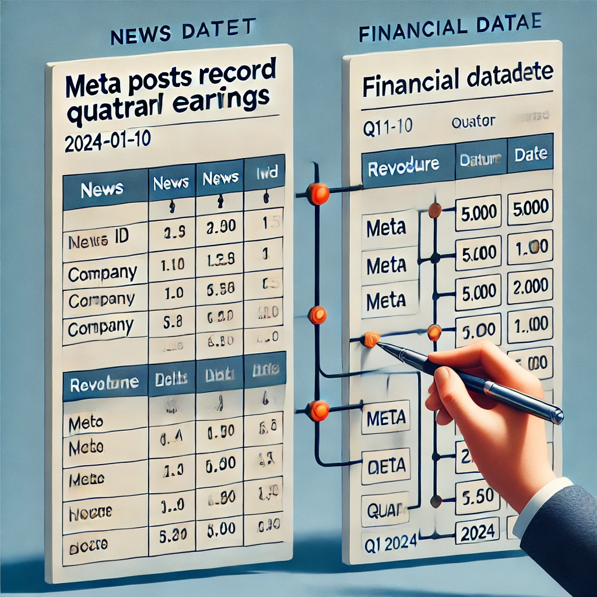
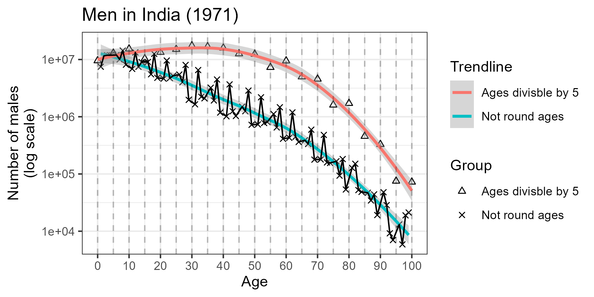
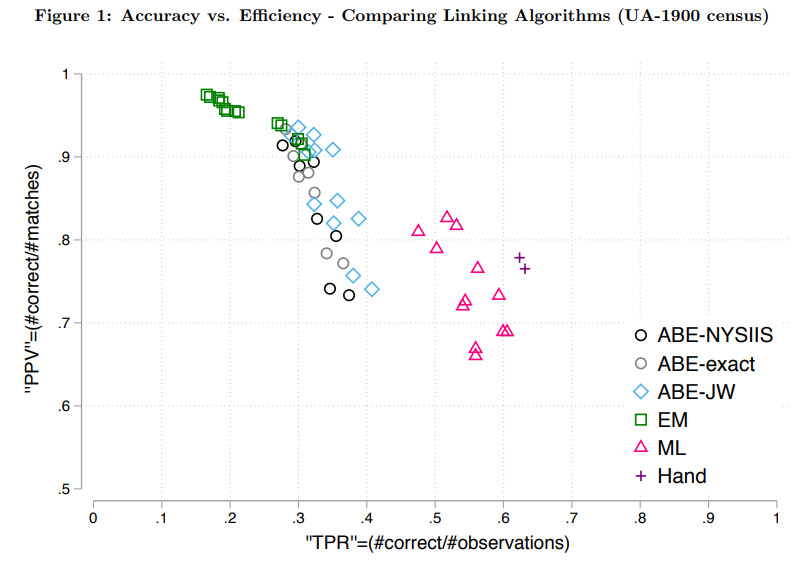

```{r setup, include=FALSE}
knitr::opts_chunk$set(eval=TRUE, include=TRUE, cache=FALSE)
library(reticulate)
use_condaenv("sentimentF23")
```

```{r xaringan-panelset, echo=FALSE}
xaringanExtra::use_panelset()
```

```{r xaringan-tile-view, echo=FALSE}
xaringanExtra::use_tile_view()
```

```{r xaringanExtra, echo = FALSE}
xaringanExtra::use_progress_bar(color = "#808080", location = "top")
```

```{python include=FALSE}
def print_it(x):
  for i in x: print(i)
```

```{css echo=FALSE}
.pull-left {
  float: left;
  width: 44%;
}
.pull-right {
  float: right;
  width: 44%;
}
.pull-right ~ p {
  clear: both;
}


.pull-left-wide {
  float: left;
  width: 66%;
}
.pull-right-wide {
  float: right;
  width: 66%;
}
.pull-right-wide ~ p {
  clear: both;
}

.pull-left-narrow {
  float: left;
  width: 30%;
}
.pull-right-narrow {
  float: right;
  width: 30%;
}

.small123 {
  font-size: 0.80em;
}

.large123 {
  font-size: 2em;
}

.red {
  color: red
}
```

# Last time
.pull-left[
- Causality
]

.pull-right-narrow[

]

---
class: middle
# Today's lecture
.pull-left[
**Two tedious common tasks:**
- Record Linking
- Topic Modeling 
]

.pull-right-narrow[

]

---

class: middle
# Why Record Linking?

.pull-left[
- **Record Linking**:
  - Given two sets of records, we want to identify the same entities
- **Massive Data Streams**:
  - News articles, social media posts, and market reports.
- **Challenge**:
  - No standard representation for entities (e.g., “Johnson & Johnson” vs. “J&J”).
- **Key Goal**:
  - Link mentions of the same company, executive, or event across datasets.
- **Example**:
  - Match earnings reports to market news referring to “Johnson & Johnson” or “JNJ.”
- **Content**: 
  - Today's lecture draws a lot on recent advances in census linking - lessons apply readily elsewhere
]

.pull-right-narrow[

]

---

class: middle
# Record Linking in Practice

.pull-left[
- **String Similarity Measures**:
  - Handle variations in names and spelling differences.
  - Levenshtein distance and Jaro-Winkler improve match accuracy.
- **Blocking Variables**:
  - Efficiently narrow down candidate matches by grouping (e.g., by dates, regions).
  - Blocking needs to be immutable facts.
- **Example**:
  - Link “J&J” in social media with “Johnson & Johnson” in news reports for sentiment analysis.
]

.pull-right-narrow[

]

---
# Example
.panelset[
.panel[
.panel-name[Financial data]
```{r, include=FALSE}
library(tidyverse)
df = read_csv("Data/Linking_toydata/Financial_Data.csv")
```

```{r echo=FALSE}
DT::datatable(df, options = list(pageLength = 6))
```

]
.panel[
.panel-name[Headlines data]
```{r, include=FALSE}
library(tidyverse)
df = read_csv("Data/Linking_toydata/News_Articles_Data.csv")
```

```{r echo=FALSE}
DT::datatable(df, options = list(pageLength = 6))
```

]
]

---
# String Distance Measures
.pull-left[
- **Common String Distance Metrics**:
  + **Levenshtein Distance**: Counts insertions, deletions, and substitutions.
  + **Jaro-Winkler**: Focuses on common prefixes.
  + **Hamming Distance**: Simple metric for strings of equal length.

]

.pull-right-narrow[
**Levenshtein Example**:  
kitten → sitting  
1. Sub 'k' → 's': `sitten`  
2. Sub 'e' → 'i': `sittin`  
3. Insert 'g': `sitting`
]

---
# Jaro-Winkler Distance
.pull-left[
- Weighted similarity measure:

  + Gives higher weight to common prefixes.
  + More robust for small variations.
Example: "jellyfish" vs. "smellyfish" 

```{python}
from nltk.metrics.distance import edit_distance, jaro_similarity

# Strings to compare
str1, str2 = "jellyfish", "smellyfish"
str3, str4 = "jellyfish", "jellyfic"

# Levenshtein distance
lev_dist1 = edit_distance(str1, str2)
lev_dist2 = edit_distance(str3, str4)

# Jaro-Winkler similarity
jw_sim1 = jaro_similarity(str1, str2)
jw_sim2 = jaro_similarity(str3, str4)
```
]

.pull-right[ 
.small123[
```{python}
print(f"Levenshtein: {lev_dist1}")
print(f"Levenshtein: {lev_dist2}")
print(f"Jaro-Winkler: {jw_sim1}")
print(f"Jaro-Winkler: {jw_sim2}")
```
]
]

---
# Linking steps


**Source A**: Financial data; **Source B**: News data

--

.small123[
#### 1. Pick record
- We will pick the first record 'META' in Q1 2024 for **A**
]

--

.small123[
#### 2. Perform blocking
- We will only consider data from source **B**, which is in Q1 2024
- (Why not consider all of it?)
- We will now refer to the blocked version of **B** as **B'**
]

--

.small123[
#### 3. Run comparison
- Compare (distance/divergence) 'META' to all the the entity names in **B'**
- "META"="Meta"? "META"="Tesla"?, "META"="Nvidia", ...?
]

--

.small123[
#### 4. Make link
- Most probable link is candidate link
]

--
.small123[
#### 5. Repeat and make final decisions
- Repeat process for all data and make final decision
]

---
# The complications (1/3)

- Start with 'TSLA' in Q1 2024
- We can eliminate 'Spotify', 'Netflix', 'Oracle', 'Alphabet' by blocking (none in Q1)
- `LevDist('TSLA', x) for x in ['Meta', 'Tesla', 'Apple', 'Microsoft']`
  + [4, 4, 5, 9]
  + **"TSLA" is equally likely to be "Meta" or "Tesla"**
--

- Now we convert everything to lower case and repeat
- `LevDist('tsla', x) for x in ['meta', 'tesla', 'apple', 'microsoft']`
  + [3, 1, 4, 8] 
  + **"Tesla" is the most likely match to "TSLA"**

**Takeaway:** Forgetting to lowercase completely ruined the matching

---
# The complications (2/3)

### First step

- Start with 'GOOGL' in Q2 2024
- We can eliminate 'meta', 'tesla', 'apple', 'microsoft' by blocking (none in Q2)

- `LevDist('googl', x) for x in ['spotify', 'netflix', 'oracle', 'alphabet']`
  + [6, 6, 5, 8]: "GOOGLE" is likely to be "oracle"

- We eliminate 'oracle' from our future searches (since we know that 'googl'='Oracle')

---
# The complications (3/3)

### Second step

- Now we get to 'ORCL' in Q2 2024  
- We can eliminate 'meta', 'tesla', 'apple', 'microsoft' by blocking (none in Q2)
- We can eliminate 'Oracle' because it was already matched

- `LevDist('orcl', x) for x in ['spotify', 'netflix', 'alphabet']`
  + [6, 6, 8]: "ORCL" is likely to be "spotify" or "netflix"


--

**Result**: We matched "GOOGL" to "Oracle" and "ORCL" to "Spotify" or "Netflix".  
**Correct link**: "GOOGL" to "Alphabet" and "ORCL" to "Oracle"  
**Takeaway:** First best matches are not universally best matches


---
# Approaches

--
### Simplest solution
- Match it manually

--
### Better solution
- Produce dictionary of e.g. stock ticker names versus full names
- Run prediction
- Manually verify

--
### Scalable solution
- Run fully automatic matching
- No 'best' method.
- Experience pain and lost sleep

**Note: All approaches are error-prone and causes bias**


---
class: middle
# The Computational Challenge of Linking

.pull-left[
### High Dimensionality
- As dataset sizes grow, the number of potential comparisons increases dramatically.
  - **Example**: Linking 10^6 records in **Dataset A** to 10^6 records in **Dataset B** requires up to 10^12 comparisons without blocking.
- Blocking reduces this, but the complexity grows with:
  + Number of blocking keys (e.g., dates, regions).
  + Number of candidates within blocks.
  + Immutable facts are not always immutable: Date of birth might change


]

.pull-right[

### Trade-offs in Blocking
- **Coarse Blocking**:
  - E.g. year instead of exact date
  - Risk of problematic matches
  - Lower probability of false negative matches 
  - High recall
- **Fine Blocking**:
  - E.g. exact date
  - Captures more true matches but misses many relevant matches
  - High precision
- Theoretical optimum (given preferences) exists, but hard to find
]


---
class: middle, inverse
# Case: Census Linking

---
class: middle

# What to take from this case

- Seemingly strong blocking variables might not be so strong 
- There is noise in the matching variables, which is hard to overcome
- There are (potentially relatively surmountable) problems, which have not been solved  

---
class: middle
# Linking Historical Census Data

.pull-left-wide[
- No unique identifiers for people (e.g., CPR)
- Clearly defined entities: People
- Data spans decades and millions of records. 
- Danish example: https://link-lives.dk/en/about-link-lives/ 
]


---
class: middle
# Challenges

.pull-left-narrow[
- **Ambiguous Records**:
  - Name variations and misspellings.
    + "Johannes", "Johan", "Hans", "John"
    + Relative Lev. Dist. from Hans to John: 100%
  - Age misreporting
    + Age heaping
  - High mobility leads to incomplete records.
    + Can you block on location? 
]

```{r echo=FALSE, message=FALSE}
library(DemoTools)
library(tidyverse)
df = data.frame(
  males = pop1m_ind
) %>% 
  mutate(
    age = 0:(n()-1)
  )

df_no_heap = df %>% 
  filter(
    !age %% 5 == 0
  )
df_heap = df %>% 
  filter(
    age %% 5 == 0
  )


p1 = df_no_heap %>% 
  ggplot(aes(age, males)) + 
  geom_point(aes(shape = "Not round ages")) + 
  geom_smooth(aes(col = "Not round ages")) + 
  geom_point(
    aes(shape = "Ages divisble by 5"), data = df_heap
  ) + 
  geom_smooth(aes(col = "Ages divisble by 5"), data = df_heap) +
  scale_shape_manual(values = c(2, 4)) + 
  theme_bw() + 
  scale_y_log10() + 
  geom_line() + 
  labs(
    colour = "Trendline",
    shape = "Group",
    y = "Number of males\n(log scale)",
    x = "Age",
    title = "Men in India (1971)"
  ) + 
  scale_x_continuous(breaks = seq(0, 100, by = 10)) +
  geom_vline(xintercept = seq(0, 100, by = 5), alpha = 0.25, lty = 2)

# p1
ggsave("Figures/Age_heaping_India.png", plot = p1, width = 6, height = 3)
  
```

.pull-right-wide[

.small123[
Source: https://timriffe.github.io/DemoTools/articles/Age-heaping_quality_with_Demotools.html
]

]


---
class: middle
## Blocking Strategies

.pull-left[
- Use immutable facts (e.g., birth year and place).
- Race does not work very well in some cases
- It is hard to be over optimistic on how well people report basic facts about themselves
- Balance between precision and recall.
- Use age ranges instead of exact ages, or use some distance measure e.g. $1/(age_i - age_j)$
]

---
# It will never be perfect

.pull-left[
- There is a frontier of matching rate versus accuracy
- It will always exist 
- Choices needs to be made on what kind of problems you prefer
]


.pull-right[

*Figure 1 from Abamitzky et al (2020)*
]

---
# Bias (1/2)

- Imagine you are interested in computing peoples lifetime income profiles across geography (important in market segmentation)
- Can you trust estimates based on linked samples? 
--

- Generally no
- Unique names are easier to match
- Unique names are more common for people with higher income


---
# Bias (2/2)

- Gets more complicated in regression analysis:

$$\log(Income_{i,2}) = \log(Income_{i,1})\beta_1 + \textbf{Z}\delta + \varepsilon_i$$
Would estimate intergenerational mobility if:
1. We know that the sample is not selected
2. There is only limited measurement error


---
class: middle

# Advice
1. **Avoid it**: Avoid having to do linking by providing unique ids to all your data. Tell team members, that they are potentially causing serious harm if they don't.
2. **Accept defeat**: It will never be perfect. Instead you face a trade-off between false positives and false negatives as well as seleciton bias 
3. **Efficient use of time**: Are you spending *3 weeks* developing something to save *3 days of manual work*? Then don't. 
4. **Human-computer-hybrid**: Often it is useful to produce a (bad) link with string distance manually improve it. 


---
class: middle
# Further reading
- For a more formalized approach: Fellegi-Sunter model
- [Introduction to Fellegi-Sunter model](https://moj-analytical-services.github.io/splink/topic_guides/theory/fellegi_sunter.html)


---
# Topic Modeling 
.pull-left[
- A common issue when dealing with text, is that we want to extract topics 
- *This is an unsupervised learning task*
  + E.g. clustering 
- We can derive valuable clusters from the classical approach 'Bag of words' 
  + k means
  + Latent Diriclet Allocation
- Great results from more modern approaches
  + K means - just in embedding space
]

.pull-right[

]

---
# K Means
.pull-left[
- **Representation:**
  + **Bag of Words (BoW):** Each document represented by word frequencies.
- **Algorithm:**
  + K means leverages BoW for simple document similarity based on word occurrences.
- The simplest form of topic discovery. 
- Requires tinkering to get useful results
  
]

.pull-right[

]

---
# K-Means implementation
.pull-left[
.small123[
### Steps
- **Step 0:** Clean data, remove stopwords, etc.
- **Step 1:** BoW representaiton
  + Each document is represented as a vector of word frequencies 
- **Step 2 (optional):** Consider reducing the dimensionality of the problem
  + I.e. limit to only useful words using PCA or other heuristics 
- **Step 3:** Run K means for k in 1:K
  + Use some evaluation metric to choose optimal k. 
  + Metrics: Sum of squared errors
  + Criterion: Elbow point
  
**See [Lecture 6 - Record linking/Code/K_means_topic_modelling.py](https://github.com/christianvedels/News_and_Market_Sentiment_Analytics/blob/main/Lecture%206%20-%20Record%20linking/Code/K_means_topic_modelling.py)**
]

]

.pull-right[
.small123[
### Each K means run:
Init: Set k means $\{\mathbf{m}^{(k)}\}$ randomly

1. **Assignment**
  + Measure distances $\{Dist\} = Dist\left(\mathbf{m}^{(k)},\mathbf{x}^{(n)}\right)$ using e.g. Euclidean or Cosine distance
  + Assign all elements of $\mathbf{x}^{(k)}$ to an element of $\mathbf{m}^{(k)}$ for which $\{Dist\}$ is minimal
  
2. **Update**
  + Updates all $\mathbf{m}^{(k)}$ to be equal to the mean of its assigned elements of $\mathbf{x}^{(k)}$
  
- **Repeat 1 and 2 until convergence**
  
MacKay (2003), p. 286
]

]

---
# Latent Dirichlet Allocation (LDA)
.pull-left[
- We imagine that every document is generated in the BoW way
- But in two steps:
  1. Each document is a mixture of topics 
  2. Each topic is a mixture of words
- 1. and 2. are drawn from a Dirichlet distribution
- Topics are the latent part we are trying to identify
]

.pull-right[

]

---
# Latent Dirichlet Allocation (LDA) Implementation
.pull-left[
.small123[
### Steps
- **Step 0:** Clean data, remove stopwords, etc.
- **Step 1:** Prepare the document-term matrix (DTM)
  + Each document is represented as a vector of word frequencies or other features
- **Step 2:** Run LDA for a given number of topics
  + Use some evaluation metric to choose the optimal number of topics.
  + Criterion: Elbow point
  
**See [Lecture 6 - Record linking/Code/LDA_topic_modelling.py](https://github.com/christianvedels/News_and_Market_Sentiment_Analytics/blob/main/Lecture%206%20-%20Record%20linking/Code/LDA_topic_modelling.py)**
]

]

.pull-right[
.small123[
### LDA estimation
**Hiearchical Bayesian model**
- $\theta_i\sim Dir(\alpha)$: Topic mixture distribution
- $\varphi_k\sim Dir(\beta)$: Word in topic k

To generate one document repeat:
1. Choose topic $z_{ij} \sim Multinomial(\theta_i)$ 
2. Choose word from topic $w_{ij}\sim Multinomial(\varphi_{z_{ij}})$

Can be estimated with Markov Chain Monte Carlo. E.g. Gibbs sampling

*[What is a Dirichlet distribution? It's a distribution of distributions](https://en.wikipedia.org/wiki/Dirichlet_distribution)*

]

]

---
# Sentence-Level Transformers and Clustering
.pull-left[
- Leverage advanced transformer models for sentence embeddings.
- Understand context and semantics at a fine-grained level.
- Utilize these embeddings for document clustering in the embedding space.
]

.pull-right[

]

---
# Sentence-Level Transformer Embeddings
.pull-left[

### Approach
- Use transformer models designed for sentence embeddings (e.g., DistilBERT, RoBERTa).
- Sentence embeddings capture rich contextual information.
- Fine-tune or use pre-trained models for diverse downstream tasks.
- Create embeddings for each sentence in the dataset.

[Lecture 6 - Record linking/Code/Embedding_topic_modelling.py](https://github.com/christianvedels/News_and_Market_Sentiment_Analytics/blob/main/Lecture%206%20-%20Record%20linking/Code/Embedding_topic_modelling.py)

]

.pull-right[

### Steps
1. Embed the sentences
2. Reduce dimensions (PCA, t-SNE)
3. Run clustering algorithm (K-means)

]

.footnote[
For more SoTA approaches see [Avrim & Haghtalab (2016)](https://arxiv.org/abs/1611.01259) and its papers that cite it (check e.g. [researchrabbit.ai/](https://www.researchrabbit.ai/))  
Consider topic modelling as an encoder decoder task, where the encoder is forced to sample from a topic distribution. 
]

---
class: inverse, middle
# Coding challenge: 
## [Linking in practice](https://github.com/christianvedels/News_and_Market_Sentiment_Analytics/blob/main/Lecture%206%20-%20Record%20linking/Coding_challenge_lecture6.md)


