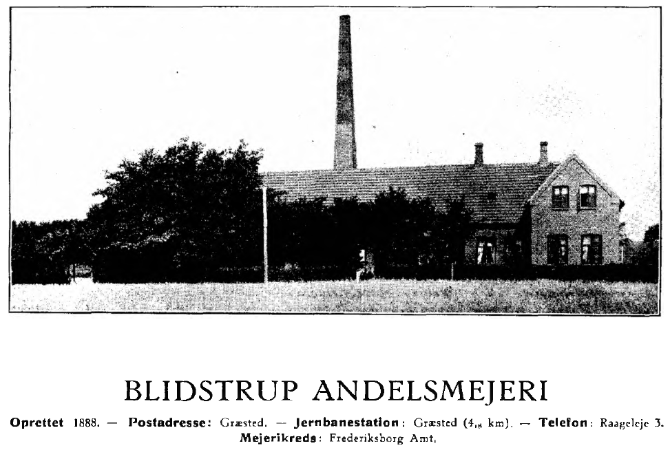
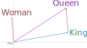

```{r setup, include=FALSE}
knitr::opts_chunk$set(eval=TRUE, include=TRUE, cache=FALSE)
library(reticulate)
use_condaenv("sentimentF23")
```

```{r xaringan-panelset, echo=FALSE}
xaringanExtra::use_panelset()
```

```{r xaringan-tile-view, echo=FALSE}
xaringanExtra::use_tile_view()
```

```{r xaringanExtra, echo = FALSE}
xaringanExtra::use_progress_bar(color = "#808080", location = "top")
```

```{css echo=FALSE}
.pull-left {
  float: left;
  width: 44%;
}
.pull-right {
  float: right;
  width: 44%;
}
.pull-right ~ p {
  clear: both;
}


.pull-left-wide {
  float: left;
  width: 66%;
}
.pull-right-wide {
  float: right;
  width: 66%;
}
.pull-right-wide ~ p {
  clear: both;
}

.pull-left-narrow {
  float: left;
  width: 30%;
}
.pull-right-narrow {
  float: right;
  width: 30%;
}

.small123 {
  font-size: 0.80em;
}

.large123 {
  font-size: 2em;
}

.red {
  color: red
}
```

# Last time
.pull-left[
- Course overview
- How did we get to ChatGPT? (And what are the implications)
- An example of some research I do using the techniques of the course
]

.pull-right[

]

---
# Exam
- January 13-20
- Relatively open format

**Generic format**

- "Demonstrate the skills you have learned in this course to gain relevant and useful insights into [x]"
- Example of [x]:
  + The corpus of Reuters articles from NLTK 
  + Financial news, that you are asked to find yourself 
  + Trap Danmark, which you are asked to scrape from http://runeberg.org/trap/2-1/0053.html 
  
- You submit the exam as a pdf containing: 
  + A paper describing: The **objective** of your project, the **NLP-tools** you used, and why you think they are **appropriate**, a **demonstration or the results** you ended with and **how well it performs**. 
  + A link to a GitHub-repository.
  + Alternatively: A well-documented appendix with code. 

---
# Today's lecture
.pull-left[
- The idea of **Embedding Space**
  + **Word embedding**
  + **Sentence embeddings**


- **String distances**:
  + Edit distance
  + Semantic distance
]

.pull-right[

]

---
# Edit Distance in String Analysis
.pull-left[
- **Simple string distances**
  + Hamming distance
  + Levensthein distance
  + Jaro-Winkler distance
  + Useful for quantifying dissimilarity between strings
  
- **Applications**
  + Fuzzy matching 
  + Spell correction 
  + Working with transcribed sources 
]

.pull-right[
**Levensthein distance**  
kitten $\rightarrow$ sitting
1. sitten (substitution of 's' for 'k')
2. sittin (substitution of 'i' for 'e')
3. sitting (insertion of 'g')
]

---

# Levensthein distance

.pull-left[
- Most common basic string distance measure 
- $O(mn)$ complexity - you can run it 
- Consists of edits: deletions, insertions, substitutions 
]


.pull-right[
**Levensthein distance**  
kitten $\rightarrow$ sitting
1. sitten (substitution of 's' for 'k')
2. sittin (substitution of 'i' for 'e')
3. sitting (insertion of 'g')
]


---

# Jaro-Winkler Distance

.pull-left[
- **Definition**
  - Measures the similarity between two strings, allowing for minor differences
  - Similar to Levenshtein Distance but gives more weight to common prefixes
  - Complex formula
  - Achieves higher weights on first letters
]

.pull-right[
```{python edit-distance}
from nltk.metrics import edit_distance
from nltk.metrics.distance import jaro_winkler_similarity

str1 = "jellyfish"
str2 = "smellyfish"

lev_distance = edit_distance(str1, str2) / max(len(str1), len(str2))
jw_distance = jaro_winkler_similarity(str1, str2)

print(f"Lev. dist: {lev_distance}")
print(f"JW dist: {jw_distance}")
```

]

---

# Hamming Distance

.pull-left[
- **Definition**
  - Even simpler than Levensthein
]

.pull-right[
- **Example**
  - *karolin* and *kathrin* have a Hamming Distance of 3 (l, o, i)
]


---
# Spell correction with Levensthein distance
.pull-left[
- Correcting misspelled words in a text
- Levenshtein Distance helps identify the closest correct spelling
- This is a simple and functional spell correction technique used in a lot of software
]

.pull-right[
```{python spelling-correction}
from nltk.metrics import edit_distance

# Original text
text = "The cat sat on the met."

# Misspelled word
misspelled_word = "met"

# Candidate correct words
correct_words = ["mat", "mete", "meet", "meat"]

# Select the word with the minimum Levenshtein Distance as the correction
closest_word = min(correct_words, key=lambda word: edit_distance(misspelled_word, word))

print(f"Closest Correct Spelling: {closest_word}")

```

]

---
# Record Linking
.pull-left[
- **Definition**
  + Process of identifying and linking records that correspond to the same entity across different data sources
- **Challenges**
  + Variations in data format and structure
  + Presence of errors and inconsistencies
]

.pull-right[

]

---

# Record Linking with edit distance
.pull-left[
- **String Matching**
  + Levenshtein Distance for approximate matching of strings
  + Jaro-Winkler Distance for similarity calculation
- **Blocking**
  + Narrowing down potential matches by creating blocks based on certain criteria
  
  

]

.pull-right[
**Example: Identifying same entities in historical data**
- 'blidstrup', 'bildstrup', 'bilstrp', 'blidstrup', 'ballerup', 'baulum'
- How do we find the same creamery in 33k observations of data with typos? 
- Levensthein distance + blocking (Sharp, Henriques, McLaughlin, Tsoukli, Vedel, 2023)
]

---
# Embeddings: The idea
.pull-left[
- Encode language such that semantics is encoded in vector operations
- Embedding vectors can be manipulated algebraically
- Example: `Emb(King) + Emb(Woman) = Emb(Queen)`
- Replaces [semantic nets](https://raw.githack.com/christianvedels/News_and_Market_Sentiment_Analytics/main/Lecture%201%20-%20Context%20and%20setup/Slides.html#10) 
]

.pull-right[

]


---
# Semantic Distance vs Edit Distance
.pull-left[
- **Semantic Distance**
  + Measures the meaning or similarity between strings
  + Considers the context and semantics
  + Suitable for applications requiring understanding of content
]

.pull-right[
- **Edit Distance**
  + Measures the dissimilarity based on the number of operations needed
  + Sensitive to character-level differences
  + Suitable for applications involving textual variations and corrections
]


---
# When to use

.pull-left[
### When to Use Semantic Distance
- **Natural Language Understanding**
  + Sentiment Analysis
  + Intent Recognition
- **Contextual Analysis**
  + Understanding relationships between words
  + Machine Translation
]

.pull-right[
### When to Use Edit Distance
- **Textual Variations**
  + Spell Correction
  + Fuzzy Matching
- **Error Detection**
  + DNA Sequence Analysis
  + Plagiarism Detection
]


---
# Cosine distance
$$
dist\left(Embd(a),\, Embd(b)\right) = cos(\theta_{a, b})
$$


- Ignoring differences in magnitudes, how close are vectors?

- Do they point in the same direction $\theta=0$ or opposite directions $\theta = \pi$

- Lives inside OneShotClassification as you already saw

See [Cosine Similarity, Clearly Explained!!!](https://youtu.be/e9U0QAFbfLI?si=rsO3qxzxSjLTvIlP)


---
# Word Embeddings in spaCy
.pull-left-narrow[
- Getting embeddings in spacy is easy
]

.pull-right-wide[
```{python spaCy-embeddings}
import spacy
nlp = spacy.load("en_core_web_lg")
sentence = "Word embeddings capture meaning."
doc = nlp(sentence)
for token in doc:
    print(token.text, token.vector[:5])
```
]

---
# Vector arithmetic

```{python include=FALSE}
import numpy as np
```

```{python vector-arithm}
# Example in spaCy
king = nlp("king").vector
woman = nlp("woman").vector
queen = king - nlp("man").vector + woman
queen_true = nlp("queen").vector

queen[:5]
queen_true[:5]

```


---
# Cosine similarity (with maths)
```{python similarity}
# Example in spaCy
token1 = nlp("cat").vector
token2 = nlp("dog").vector

cosine_similarity = np.dot(token1, token2) / (np.linalg.norm(token1) * np.linalg.norm(token2))
print(cosine_similarity)
```

---
# Cosine similarity (build in spacy)
```{python sim_spaCy}
# Example in spaCy
token1 = nlp("cat")
token2 = nlp("dog")

similarity_score = token1.similarity(token2)
print(similarity_score)
```


---
# Under the hood of zero-shot classification
[Lecture 6 - The meaning of sentences/Code/spaCy_zeroshot.py](https://github.com/christianvedels/News_and_Market_Sentiment_Analytics/blob/main/Lecture%206%20-%20The%20meaning%20of%20sentences/Code/spaCy_zeroshot.py)


Also see [Zero-Shot Learning in Modern NLP](https://joeddav.github.io/blog/2020/05/29/ZSL.html)

---
# Where to get embeddings?

- Just start with spaCy
- Any of the language models out there on hugging face
- Can also be used with a model you train 
- [**How?** Cut off the final layer](https://raw.githack.com/christianvedels/Guest_Lectures_and_misc_talks/main/HISCO/Slides.html#30)

---
## References

.small123[
Sharp, P., Henriques, S., McLaughlin, E., Tsoukli, X., & Vedel, C. (2023). A Microlevel Analysis of Danish Dairy Cooperatives: Opportunities for Large Data in Business History. Enterprise & Society, 1-29. https://doi.org/10.1017/eso.2023.13 
]


